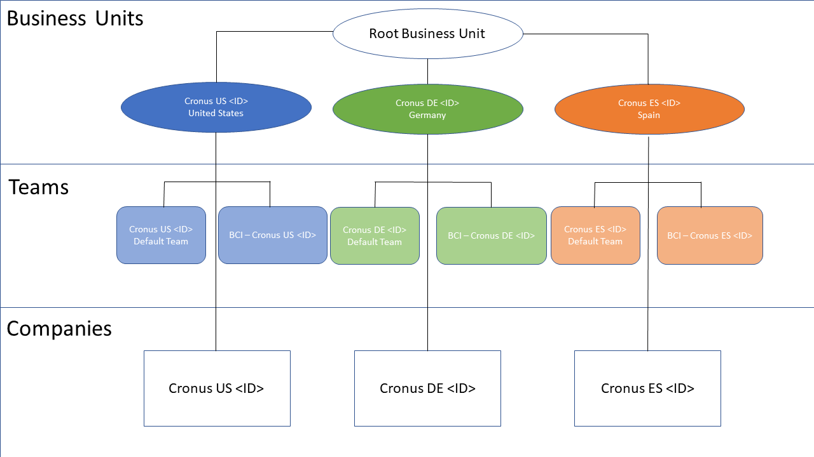
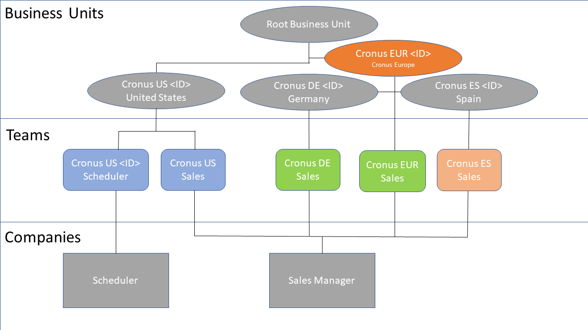

# Modely vlastnictví dat
[!INCLUDE[d365fin](includes/cds_long_md.md)] vyžaduje, abyste pro data, která ukládáte, určili vlastníka. Pro více informací navštivte [Vlastnictví entity](https://docs.microsoft.com/powerapps/maker/common-data-service/types-of-entities#entity-ownership) v dokumentanci Power Apps. Při nastavování integrace mezi [!INCLUDE[d365fin](includes/cds_long_md.md)] a [!INCLUDE[d365fin](includes/d365fin_md.md)] musíte pro synchronizované záznamy zvolit jeden ze dvou modelů vlastnictví:

* Týmy
* Osoba (uživatel)

Akce, které lze u těchto záznamů provádět, lze řídit na úrovni uživatele. Pro více informací navštivte [Uživatelské a týmové entity](https://docs.microsoft.com/powerapps/developer/common-data-service/user-team-entities). Doporučujeme model vlastnictví týmu, protože usnadňuje správu vlastnictví pro více lidí.

## Vlastnictví týmu
V [!INCLUDE[d365fin](includes/d365fin_md.md)], je společnost právnickou a obchodní entitou, která nabízí způsoby, jak zabezpečit a vizualizovat obchodní data. Uživatelé vždy pracují v kontextu společnosti. Nejblíže tomu, co k tomuto konceptu přichází [!INCLUDE[d365fin](includes/cds_long_md.md)] je entita obchodní jednotky, která nemá právní nebo obchodní důsledky.

Vzhledem k tomu, že organizační jednotky postrádají právní a obchodní důsledky, nelze vynutit mapování 1:1 (1:1) k synchronizaci dat mezi společností a organizační jednotkou, a to buď jednosměrnou, nebo obousměrnou. Aby byla synchronizace možná, povolte synchronizaci pro společnost v [!INCLUDE[d365fin](includes/d365fin_md.md)] a následující se stane v [!INCLUDE[d365fin](includes/cds_long_md.md)]:

* Vytvoříme subjekt společnosti, který je ekvivalentní subjektu společnosti v [!INCLUDE[d365fin](includes/d365fin_md.md)]. Název společnosti je doplněn "BC Company ID." Například Společnost Cronus International Ltd. (93555b1a-af3e-ea11-bb35-000d3a492db1).
* Vytvoříme výchozí organizační jednotku, která má stejný název jako společnost. Například Společnost Cronus International Ltd. (93555b1a-af3e-ea11-bb35-000d3a492db1).
* Vytvoříme samostatný tým vlastníků se stejným názvem jako společnost a přidružíme jej k organizační jednotce. Název týmu je předponou "BCI -." Například BCI - Cronus International Ltd. (93555b1a-af3e-ea11-bb35-000d3a492db1).
* Záznamy, které jsou vytvořeny a synchronizovány s [!INCLUDE[d365fin](includes/cds_long_md.md)] jsou přiřazeny týmu "BCI Owner", který je propojen s obchodní jednotkou.

> [!NOTE]
> Pokud přejmenujete společnost v [!INCLUDE[d365fin](includes/d365fin_md.md)], názvy společností, podniků a týmů, které vytváříme automaticky v [!INCLUDE[d365fin](includes/cds_long_md.md)] nejsou aktualizovány. Vzhledem k tomu, že pro integraci se používá pouze ID společnosti, nemá to vliv na synchronizaci. Pokud chcete, aby se názvy shodovaly, musíte aktualizovat společnost, organizační jednotku a tým v [!INCLUDE[d365fin](includes/cds_long_md.md)].

Následující obrázek ukazuje příklad tohoto nastavení dat v [!INCLUDE[d365fin](includes/cds_long_md.md)].

V této konfiguraci budou záznamy, které souvisejí se společností Cronus US, vlastněny týmem, který je propojen s cronus US <ID> obchodní jednotkou v [!INCLUDE[d365fin](includes/cds_long_md.md)]. Uživatelé, kteří mají přístup k této organizační jednotce prostřednictvím role zabezpečení, která je nastavena na viditelnost na úrovni organizační jednotky v [!INCLUDE[d365fin](includes/cds_long_md.md)] mohou nyní tyto záznamy vidět. Následující příklad ukazuje, jak pomocí týmů poskytnout přístup k těmto záznamům.

* Role Manažera prodeje je přiřazena členům amerického prodejního týmu Cronus.
* Uživatelé, kteří mají roli Správce prodeje, mají přístup k záznamům účtů pro členy stejné organizační jednotky.
* Tým prodeje společnosti Cronus v USA je propojen s obchodní jednotkou Cronus v USA, která byla zmíněna výše. Členové amerického prodejního týmu Cronus mohou vidět jakýkoli účet, který je vlastněn společností Cronus US, <ID> který by pocházel z amerického subjektu Cronus v [!INCLUDE[d365fin](includes/d365fin_md.md)].

Mapování 1:1 mezi organizační jednotkou, společností a týmem je však pouze výchozím bodem, jak je znázorněno na následujícím obrázku.

V tomto příkladu je vytvořena nová kořenová organizační jednotka EUR (Evropa) v [!INCLUDE[d365fin](includes/cds_long_md.md)] jako rodič jak pro Cronus DE (Gernamy) tak Cronus ES (Španělsko). Obchodní jednotka EUR nesouvisí se synchronizací. Členům týmu EUR Sales však může poskytnout přístup k datům účtu v Cronus DE i Cronus ES nastavením viditelnosti dat na **Nadřazenou/Podřízenou BU** o přidružené roli zabezpečení v [!INCLUDE[d365fin](includes/cds_long_md.md)].

Synchronizace určuje, který tým má vlastnit záznamy. Toto je řízeno polem **Výchozí vlastnický tým** na záznamu - <ID> BCI. Když BCI - <ID> záznam je povolen pro synchronizaci automaticky vytvoříme přidruženou organizační jednotku a tým vlastníků (pokud ještě neexistuje) a nastavíme pole **Výchozí vlastník tým**. Pokud je synchronizace povolena pro entitu, správci mohou změnit vlastnící tým, ale tým musí být vždy přiřazen.

> [!NOTE]
> Po přidání a uložení společnosti se záznamy stávají jen pro čtení, proto si vyberte správnou společnost.

## Výběr jiné obchodní jednotky
Výběr obchodní jednotky můžete změnit, pokud používáte model vlastnictví Týmů. Pokud používáte model vlastnictví osoby, je vždy vybrána výchozí obchodní jednotka.

Pokud zvolíte například jinou organizační jednotku, kterou jste vytvořili dříve v [!INCLUDE[d365fin](includes/cds_long_md.md)], zachová si svůj původní název. To znamená, že nebude příponou s ID společnosti. Vytvoříme tým, který používá konvenci pojmenování.

Při změně obchodní jednotky si můžete vybrat pouze obchodní jednotky, které jsou o jednu úroveň pod kořenovou obchodní jednotkou.

## Vlastnictví osoby
Pokud zvolíte model vlastnictví osoby, musíte zadat každého prodejce, který bude vlastnit nové záznamy. Organizační jednotka a tým jsou vytvořeny tak, jak je popsáno v sekci [Vlastnictví týmu](admin-cds-company-concept.md#team-ownership).

Výchozí organizační jednotka se používá, když je vybrán model vlastnictví osoby, a nemůžete zvolit jinou organizační jednotku. Tým, který je přidružen k výchozí obchodní jednotce, bude vlastnit záznamy o společných entitách, jako je entita produktu, které se netýkají konkrétních prodejců.

## Viz také
[O [!INCLUDE[d365fin](includes/cds_long_md.md)]](admin-common-data-service.md)