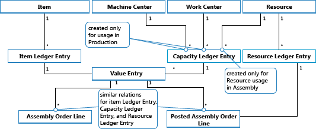
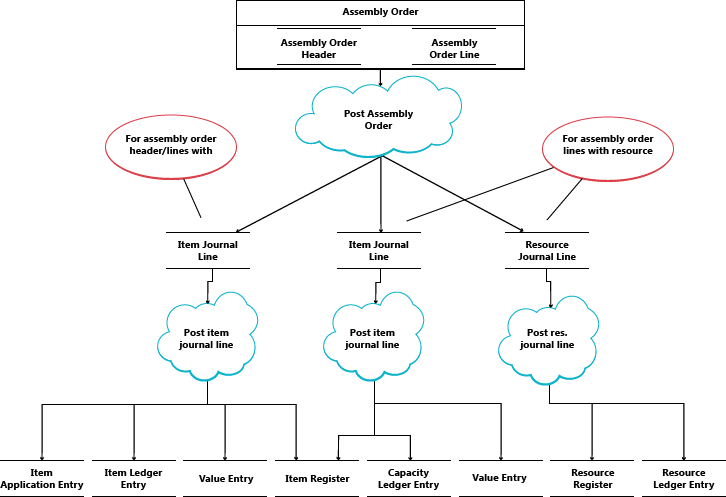

# Podrobnosti návrhu: Účtování montážní zakázky
Účtování montážní zakázky je založeno na stejných principech jako účtování podobných činností prodejních objednávek a spotřeby/produkce výroby. Zásady se však kombinují v tom, že montážní zakázky mají své vlastní účetní uživatelské rozhraní, jako je uživatelské rozhraní pro prodejní objednávky, zatímco skutečné zaúčtování položky se děje na pozadí jako přímé účtování zboží a deníku zdrojů, jako je to pro spotřebu výroby, výstup a kapacitu.

Podobně jako zaúčtování výrobní zakázky, jsou spotřebované komponenty a použité zdroje převedeny a vydány jako zboží montáže při zaúčtování montážní zakázky. Pro více informací navštivte [Podrobnosti návrhu: Účtování výrobní zakázky](design-details-production-order-posting.md). Tok nákladů na montážní zakázky je však méně složitý, zejména proto, že účtování montážních nákladů se vyskytuje pouze jednou, a proto negeneruje zásoby v podobě nedokončené práce.

Během účtování montážní zakázky dochází k následujícím zaúčtováním deníků:

- Deník zboží zaúčtuje kladné položky zboží představující výstup zboží montáže z hlavičky montážní zakázky.
- Deník zboží zaúčtuje záporné položky zboží představující spotřebu komponent montáže z řádků montážní zakázky.
- Deník zdrojů zaúčtuje využití zdrojů montáže (časové jednotky) z řádků montážní zakázky.
- Deník kapacity zaúčtuje položky ocenění vztahující se k využití zdrojů z řádků montážní zakázky.

Následující diagram ukazuje strukturu položek zboží a zdrojů, které vyplývají z účtování montážní zakázky.

> [!NOTE]
> Zahrnuty jsou strojní a pracovní centra, která ilustrují, že položky kapacity jsou vytvářeny jak z výroby, tak z montáže.

Následující diagram znázorňuje, jak data montáže proudí do položek zboží během účtování:

## Sekvence účtování
Účtování montážní zakázky probíhá v následujícím pořadí:

1. Najdříve se zaúčtují řádky montážní zakázky.
2. Pak se zaúčtuje záhlaví montážní zakázky.

V následující tabulce je popsána posloupnost akcí.

| Akce | Popis |
|------------|-----------------|  
| Inicializace účtování | 1.  Proveďte předběžné kontroly. 2.  Přidejte číslo účtování a upravte hlavičku montážní zakázky. 3.  Vydejte montážní zakázku. |
| Účtování | <ol><li>Vytvořte hlavičku zaúčtované montážní zakázky.</li><li>Zkopírujte řádky komentářů.</li><li>Zaúčtujte řádky montážní zakázky (spotřeba):   <ol><li>Vytvořte stavovou stránku pro výpočet spotřeby montáže.</li><li>Získejte zbývající množství, na kterém bude řádek deníku založen.</li><li>Resetujte spotřebované a zbývající množství.</li><li>Pro řádky montážní zakázky typu Zboží:   <ol><li>Vyplňte pole v řádku deníku zboží.</li><li>Převeďte rezervace do řádku deníku zboží.</li><li>Zaúčtujte řádek deníku zboží a vytvořte položky zboží.</li><li>Vytvořte řádky deníku skladu a zaúčtujte je.</li></ol></li><li>Pro řádky montážní zakázky typu Zdroj:   <ol><li>Vyplňte pole v řádku deníku zboží.</li><li>Zaúčtujte řádek deníku zboží. Tím se vytvoří položky kapacity.</li><li>Vytvořte a zaúčtujte řádek deníku zdrojů.</li></ol></li><li>Přeneste hodnoty pole z řádku montážní zakázky do nově vytvořeného řádku zaúčtované montážní zakázky.</li></ol></li><li>Zaúčtujte záhlaví montážní zakázky (výstup):   <ol><li>Vyplňte pole v řádku deníku zboží.</li><li>Převeďte rezervace do řádku deníku zboží.</li><li>Zaúčtujte řádek deníku zboží a vytvořte položky zboží.</li><li>Vytvořte řádky deníku skladu a zaúčtujte je.</li><li>Obnovte množství sestavy a zbývající množství.</li></ol></li></ol> |

> [!IMPORTANT]
> Na rozdíl od výstupu výroby, který je zaúčtován v očekávaných nákladech, je montážní výstup zaúčtován v reálných nákladech.

## Úprava nákladů
Jakmile je montážní zakázka zaúčtována, což znamená, že součásti (materiál) a zdroje jsou sestaveny do nového zboží, mělo by být možné určit skutečné náklady na toto zboží montáže a skutečné náklady na využity komponenty. Toho je dosaženo zasláním nákladů z zaúčtovaných položek zdroje (komponenty a zdroje) do zaúčtovaných položek v místě určení (zboží montáže). Předávání nákladů se provádí výpočtem a generováním nových položek (opravné položky), které jsou spojeny s položkami v místě určení.

Náklady na montáž, které mají být předány, jsou detekovány pomocí mechanismu detekce na úrovni objednávky. Pro informace o dalších mechanismech detekce úprav navštivte [Detaily návrhu: Úprava nákladů](design-details-cost-adjustment.md).

### Detekce úprav
Funkce detekce úrovně objednávky se používá ve scénářích převodu, výroby a montáže. Funkce funguje následovně:

- Úprava nákladů je zjištěna označením objednávky při každém zaúčtování materiálu/zdroje jako spotřebováno/použito.
- Náklady jsou předány použitím nákladů z materiálu/zdroje na výstupní položky přidružené ke stejné objednávce.

Následující obrázek znázorňuje strukturu seřízení a způsob úpravy nákladů na montáž.

### Provedení úprav
Rozložení zjištěných úprav z nákladů na materiál a zdroje na výstupní položky montáže se provádí dávkovou úlohou **Úprava nákladů - položky zboží**. Obsahuje funkci Vytvořit víceúrovňové nastavení, která se skládá z následujících dvou prvků:

- Proveďte úpravu montážních zakázek – která předává náklady z využití materiálu a zdrojů do výstupní položky montáže. Řádky 5 a 6 v níže uvedeném algoritmu jsou za to odpovědné.
- Proveďte úpravy na jedné úrovni – které předají náklady na jednotlivé zboží pomocí jejich metod ocenění. Řádky 9 a 10 v algoritmu níže jsou za to odpovědné.

> [!NOTE]
> Prvek provédění úprav NV v řádcích 7 a 8 je zodpovědný za předávání výrobního materiálu a využití kapacity na výstup nedokončených výrobních zakázek. To se nepoužívá při úpravě nákladů na montážní zakázku, protože koncept nedokončené výroby se nevztahuje na montáž.

Pro informace o tom, jak jsou náklady z montáže a výroby zaúčtovány do věcných položek, navštivte [Detaily návrhu: Účtování zásob](design-details-inventory-posting.md).

## Náklady na montáž jsou vždy skutečné
Koncept nedokončené výroby (NV) se nevztahuje na účtování montážních zakázek. Montážní náklady jsou účtovány pouze jako skutečné náklady, nikdy jako očekávané náklady. Pro více informací navštivte [Detaily návrhu: Účtování očekávaných nákladů](design-details-expected-cost-posting.md).

To je umožněno následující strukturou dat.

- Do pole **Typ** na řádcích deníku zboží v tabulkách **Položka kapacity** a **Položka ocenění**, se používá *Zdroj* k identifikaci položek zdroje montáže.
- V poli **Typ položky zboží** na řádcích deníku zboží se v tabulkách **Položka kapacity** a **Položka ocenění** používají *Výstupy montáže* a *Spotřeba montáže* k identifikaci položek zboží výstupní montáže a spotřebovaných položek komponent montáže.

Kromě toho se ve výchozím nastavení vyplní pole účto skupiny na záhlaví montážní zakázky a řádky montážní zakázky následujícím způsobem.

| Entita | Typ | Skupina zboží | Obecná  účto  Skupina zboží |
|------------|----------|-------------------|------------------------------|  
| Hlavička montážní zakázky | Zboží | Účto skupina zboží | Obecná  účto  Skupina zboží |
| Řádek montážní zakázky | Zboží | Účto skupina zboží | Obecná  účto  Skupina zboží |
| Řádek montážní zakázky | Zdroj | Obecná  účto  Skupina zboží |

V souladu s tím jsou do hlavní knihy zaúčtovány pouze skutečné náklady a z účtování montážních zakázek nejsou vyplněny žádné mezitímní účty. Pro více informací navštivte [Detaily návrhu: Účty hlavní knihy](design-details-accounts-in-the-general-ledger.md)

## Montáž na zakázku
Položka zboží, která je výsledkem zaúčtování prodeje montáže na zakázku, je pevně vyrovnána se související položkou zboží pro výstup montáže. V souladu s tím jsou náklady na prodej montáže na zakázku odvozeny od montážní zakázky, se kterou byla spojena.

Položky zboží typu Prodej, které jsou výsledkem zaúčtování množství montáže na zakázku, jsou označeny hodnotou **Ano** v poli **Montáž na zakázku**.

Řádky prodejních objednávek, kde součástí je množství zásob a další část je množství montáže na zakázku, vedou k samostatným položkám zboží, jedné pro množství zásob a jedné pro množství montáže na zakázku.

## Viz také
[Detaily návrhu: Ocenění zásob](design-details-inventory-costing.md)  
[Detaily návrhu: Účtování prodejní zakázky](design-details-production-order-posting.md)  
[Detaily návrhu: Metody ocenění](design-details-costing-methods.md)  
[Správa nákladů zásob](finance-manage-inventory-costs.md)  
[Finance](finance.md)  
[Práce s [!INCLUDE[d365fin](includes/d365fin_md.md)]](ui-work-product.md)
