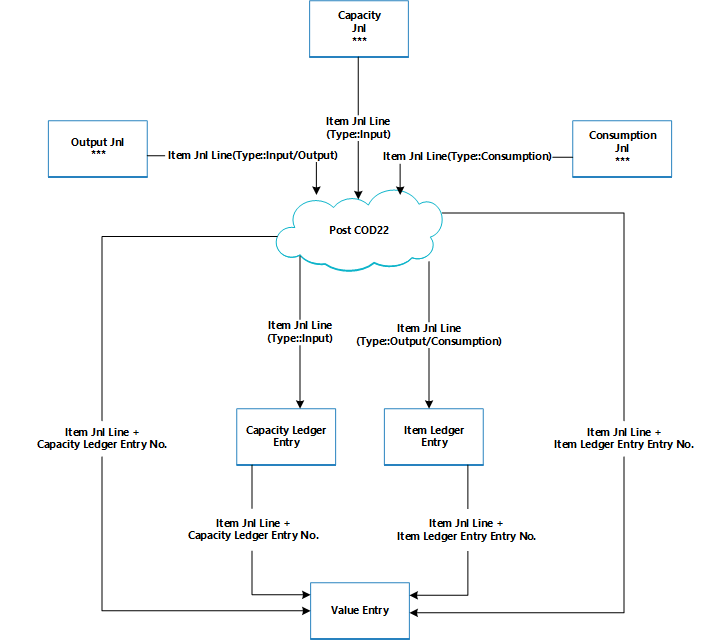
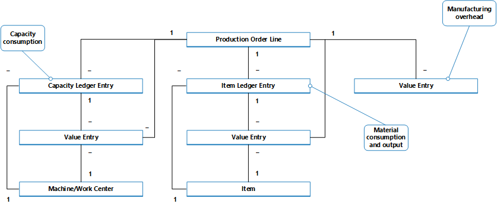

# Podrobnosti návrhu: Účtování výrobní zakázky
Podobně jako při zaúčtování montážní zakázky jsou spotřebované komponenty a použitý čas stroje převedeny a výstupem je vyrobené zboží po dokončení výrobní zakázky. Pro více informací navštivte [Detaily návrhu: Účtování montážní zakázky](design-details-assembly-order-posting.md). Tok nákladů pro montážní zakázky je však méně složitý, zejména proto, že účtování nákladů na montáž probíhá pouze jednou a nevytváří zásoby v procesu práce.

Transakce, ke kterým dochází během výrobního procesu, lze sledovat v následujících fázích:

1. Nákup materiálů a dalších výrobních vstupů.
2. Přeměna na nedokončenou výrobu.
3. Přeměna na zásoby hotových výrobků.
4. Prodej hotových výrobků.

Proto kromě běžných skladových účtů musí výrobní společnost zřídit tři samostatné skladové účty pro evidování transakcí v různých fázích výroby.

| Skladový účet | Popis |
|-----------------------|---------------------------------------|  
| **Účet surovin** | Zahrnuje náklady na suroviny, které jsou zakoupeny, ale dosud nebyly převedeny do výroby. Zůstatek na účtu Surovin označuje náklady na suroviny, které jsou k dodaní.   Když se suroviny přesunou do výroby, náklady na materiál se převedou z účtu Surovin na účet nedokončené výroby. |
| **Účet nedokončené výroby (NV)** | Kumulace nákladů vzniklých během výroby v účetním období. Účet nedokončené výroby je odepisován z nákladů na suroviny, které jsou převedeny ze skladu surovin, nákladů na přímou práci a vzniklých výrobních režijních nákladů.   Účet nedokončené výroby se připisuje k celkovým výrobním nákladům jednotek, které jsou dokončeny ve výrobním závodě a převedeny do skladu hotových výrobků. |
| **Účet hotových výrobků** | Tento účet zahrnuje celkové výrobní náklady jednotky, které jsou dokončeny, ale ještě nebyly prodány. V době prodeje se náklady na prodané jednotky převádí z účtu Hotových výrobků na účet Nákladů na prodané zboží. |

Hodnota zásob se vypočítá sledováním nákladů na všechna zvýšení a snížení vyjádřená následující rovnicí:

* hodnota zásob = počáteční zůstatek zásob + hodnota všech zvýšení - hodnota všech snížení

V závislosti na typu zásob jsou zvýšení a snížení reprezentovány různými transakcemi.

||Increases|Decreases|  
|-|---------------|---------------|  
|**Zásoby surovin**|-   Čistý nákup materiálu -   Výstup podzakázek -   Záporná spotřeba|Spotřeba materiálu|  
|**Nedokončená výroba**|-   Spotřeba materiálu -   Spotřeba kapacit -   Výrobní režie|Výstup zboží (náklady na vyrobené zboží)|  
|**Zásoby hotových výrobků**|Výstup hotových výrobků (náklady na vyrobené zboží)|-   Tržby (náklady na prodané zboží) -   Záporný výstup|  
|**Zásoby surovin**|-   Čistý nákup materiálu -   Výstup podzakázek -   Záporná spotřeba|Spotřeba materiálu|

Hodnoty zvýšení a snížení se zaznamenávají v různých typech vyrobených zásob stejným způsobem jako u nakoupených zásob. Pokaždé, když se transakce zvýšení nebo snížení zásob uskuteční, vytvoří se pro tuto částku položka zboží a odpovídající věcná položka. Pro více informací navštivte [Detaily návrhu: Účtování zásob](design-details-inventory-posting.md).

Přestože hodnoty transakcí, které souvisejí s nakoupeným zbožím, jsou zaúčtovány pouze jako položky zboží se souvisejícími položkami ocenění, transakce, které souvisejí s vyrobeným zbožím, jsou kromě položek zboží zaúčtovány jako položky kapacity se souvisejícími položkami ocenění.

## Struktura účtování
Zaúčtování výrobních objednávek do Nedokončené výroby zahrnuje výstup, spotřebu a kapacity.

Následující diagram znázorňuje princip účtování v codeunitě 22.

Následující diagram znázorňuje spojení mezi výslednými položkami a nositeli nákladů.

Položka kapacity popisuje spotřebu kapacity z hlediska časových jednotek, zatímco související položka ocenění popisuje hodnotu specifické spotřeby kapacity.

Položka zboží popisuje spotřebu materiálu nebo výstup z hlediska množství, zatímco související položka ocenění popisuje hodnotu této specifické spotřeby nebo výstupu materiálu.

Položku hodnoty, která popisuje hodnotu zásob nedokončené výroby, lze přidružit k jedné z následujících kombinací objektů nákladů:

- Řádek výrobní zakázky, pracovního nebo strojního centra a položky kapacity.
- Řádek výrobní zakázky, zboží a položka zboží.
- Pouze řádek výrobní zakázky

Další informace o tom, jak jsou náklady z výroby a montáže zaúčtovány do hlavní knihy, naleznete v tématu [Detaily návrhu: Účtování zásob](design-details-inventory-posting.md).

## Účtování kapacit
Zaúčtování výstupu z posledního řádku TNG postupu výrobní zakázky má za následek kromě zvýšení zásob také položku kapacity pro koncové zboží.

Položka kapacity je záznam času stráveného k výrobě zboží. Související položka hodnoty popisuje zvýšení hodnoty zásob nedokončené výroby, což je hodnota převodních nákladů. Pro více informací navštivte “Z položek kapacity” v [Detaily návrhu: Účty hlavní knihy](design-details-accounts-in-the-general-ledger.md).

## Náklady výrobní zakázky
K řízení zásob a výrobních nákladů musí výrobní společnost měřit náklady výrobních zakázek, protože předem stanovené standardní náklady na každou vyrobenou položku jsou kapitalizovány v rozvaze. Informace o tom, proč vyráběné položky používají metodu Standardní metody ocenění, najdete v [Detaily návrhu: Metody ocenění](design-details-costing-methods.md).

> V prostředích, která nepoužívají standardní metodu ocenění se v rozvaze kapitalizují skutečné, nikoli standardní náklady na vyrobené položky.

Skutečné náklady výrobní zakázky se skládají z následujících nákladových složek:

- Skutečné náklady na materiál
- Skutečné náklady na kapacitu nebo náklady na subdodavatele
- Výrobní režie

Tyto skutečné náklady jsou zaúčtovány do výrobní zakázky a porovnány se standardními náklady pro výpočet odchylek. Odchylky se počítají pro každou složku nákladů na zboží: suroviny, kapacitu, subdodavatele, režijní náklady na kapacitu a výrobní režii. Odchylky lze analyzovat, aby se zjistily problémy, jako je nadměrný odpad při výrobě.

V prostředí se standardními náklady je nákladování výrobní zakázky založeno na následujícím mechanismu:

1. Při zaúčtování poslední operace TNG postupu jsou náklady výrobní zakázky zaúčtovány do položek zboží a nastaveny na očekávané náklady.

   Tyto náklady se rovnají výstupnímu množství, které je zaúčtováno do deníku výstupu vynásobené standardními náklady, které jsou zkopírovány z karty zboží. Náklady jsou považovány za očekávané náklady, dokud není výrobní zakázka dokončena. Pro více informací navštivte [Detaily návrhu: Účtování očekávaných nákladů](design-details-expected-cost-posting.md).

   > [!NOTE]  
   > To se liší od zaúčtování montáží zakázky, ktera vždy zaúčtuje skutečné náklady. Pro více informací navštivte [Detaily návrhu: Účtování montážní zakázky](design-details-assembly-order-posting.md).
2. Je-li výrobní zakázka nastavena **Dokončeno**, je objednávka fakturována spuštěním dávkové úlohy **Úprava nákladů - položky zboží**. V důsledku toho se celkové náklady objednávky počítají na základě standardních nákladů spotřebovaných materiálů a kapacity. Rozdíly mezi vypočtenými standardními náklady a skutečnými výrobními náklady se počítají a zaúčtují.

## Viz také
[Detaily návrhu: Náklady zásobg](design-details-inventory-costing.md)   
[Detaily návrhu: Účtování montážní zakázky](design-details-assembly-order-posting.md)  
[Správa nákladů zásob](finance-manage-inventory-costs.md)
[Finance](finance.md)  
[Práce s Business Central](ui-work-product.md)

[!INCLUDE[footer-include](includes/footer-banner.md)]