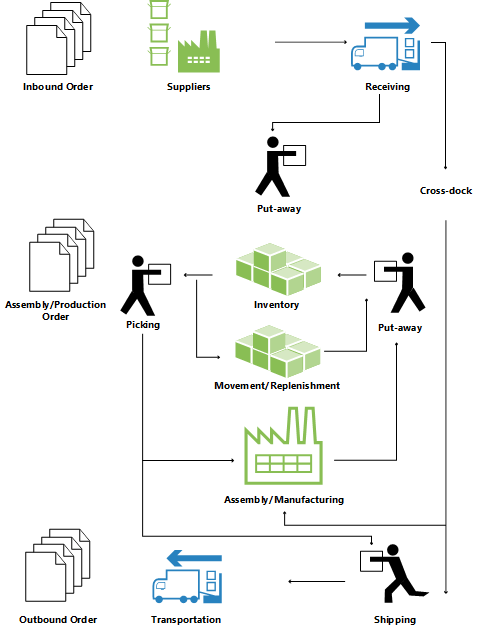

# Detaily návrhu: Přehled skladu
Pro podporu fyzického zpracování zboží v zónách a úrovních přihrádek musí být všechny informace sledovány pro každou transakci nebo přesun ve skladu. To jsou údaje spravovány v tabulce **Položky skladu**. Každá transakce je uložena v žurnálech skladu.

Skladové doklady a deník skladu se používají k evidenci pohybů zboží ve skladu. Pokaždé, když je zboží ve skladu přesunuto, přijato, zaskladněno, vyskladněno, dodáno nebo upraveno, jsou záznamy ve skladu evidovány pro fyzické uložení informací o zóně, přihrádce a množství.

Tabulka **Obsah přihrádky** se používá ke zpracování všech různých dimenzí obsahu přihrádky zboží, jako je měrná jednotka, maximální množství a minimální množství. Tabulka **Obsah přihrádky** také obsahuje počítatelné pole pro položky skladu, pokyny skladu a řádky deníku skladu, což zajišťuje, že dostupnost zboží na přihrádce a přihrádku pro zboží lze rychle vypočítat. Pro více informací navštivte [Detaily návrhu: Dostupnost ve skladu](design-details-availability-in-the-warehouse.md).

Pokud se zaúčtování položky vyskytne mimo modul skladu, použije se pro synchronizaci položek skladu se skladovým zbožím výchozí adjustační přihrádka na lokaci. Během fyzické inventury skladu jsou rozdíly mezi vypočteným a spočítanými množstvími zaznamenány do adjustační přihrádky a pak zaúčtovány jako opravné položky zboží. Pro více informací navštivte [Detaily návrhu: Integrace se zásobami](design-details-integration-with-inventory.md).

Následující obrázek nastiňuje typické procesy skladu.

## Základní nebo rozšířené skladování
Funkce skladu v aplikaci [!INCLUDE[d365fin](includes/d365fin_md.md)] lze implementovat v různých úrovních složitosti v závislosti na procesech a objemu objednávek společnosti. Hlavní rozdíl spočívá v tom, že činnosti se provádějí v základním skladu, v případě, že jsou konsolidovány pro více objednávek v rozšířeném skladu.

Pro rozlišení mezi různými úrovněmi složitosti se tato dokumentace týká dvou obecných označení, základního a rozšířeného skladování. Toto jednoduché rozlišení zahrnuje několik různých úrovní složitosti, jak je definováno v granulích produktu a v nastavení umístění, které jsou podporovány různými UI dokumenty. Pro více informací navštivte [Detaily návrhu: Nastavení skladu](design-details-warehouse-setup.md).

> [!NOTE]
> Nejpokročilejší úroveň skladování je odkazována v dokumentaci jako “Instalace WMS”, protože tato úroveň vyžaduje nejpokročilejší systémy Warehouse Management Systems.

V základním a rozšířeném skladu se používají následující různé dokumenty uživatelského rozhraní.

## Základní doklady uživatelského rozhraní

- **Zaskladnění zásob**
- **Vyskladnění zásob**
- **Přesun zásob**
- **Deník zboží**
- **Deník přeřazení zboží**
- (Různé sestavy)

## Pokročilé doklady uživatelského rozhraní

- **Skladová příjemka**
- **Sešit zaskladnění**
- **Sešit vyskladnění**
- **Sešit vyskladnění**
- **Sešit zaskladnění**
- **Sešit přesunu**
- **Skladový přesun**
- **Interní  vyskladnění**
- **Interní  zaskladnění**
- **Sešit vytvoření přihrádky**
- **Sešit vytvoření obsahu přihrádky**
- **Deník  zboží skladu**
- **Deník  přeřazení  skladu**
- (Různé sestavy)

Další informace o jednotlivých dokumentech naleznete v příslušných tématech na stránce.

### Terminologie
V souladu s finančními koncepty nákupů a prodejů odkazuje dokumentace skladu [!INCLUDE[d365fin](includes/d365fin_md.md)] na následující toky zboží ve skladu.

| Termín | Popis |
|----------|---------------------------------------|  
| Vstupní tok | Položky pohybující se do umístění skladu, jako jsou nákupy a příchozí transfery. |
| Vnitřní tok | Položky pohybující se uvnitř skladu, například výrobní komponenty a výstup. |
| Odchozí tok | Položky pohybující se mimo umístění skladu, například prodej a odchozí transfery. |

## Viz také
[Detaily návrhu: Správa skladu](design-details-warehouse-management.md)
