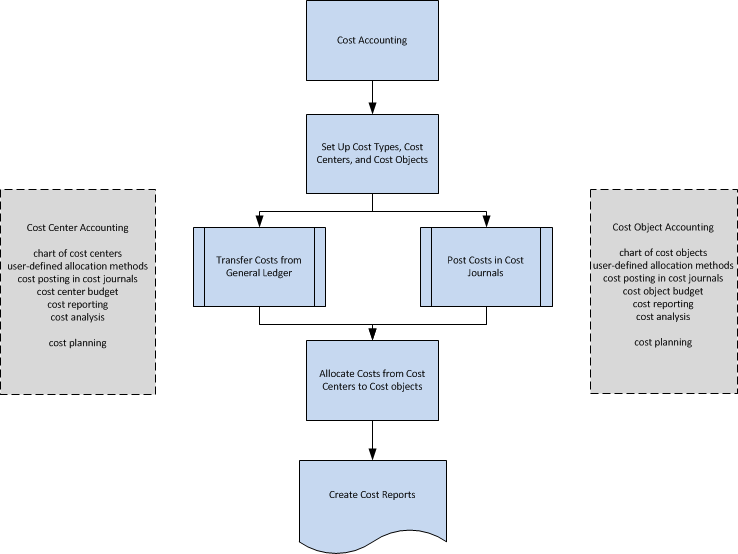

# Nákladové účetnictví
Nákladové účetnictví vám může pomoci pochopit náklady na provoz podniku. Informace o nákladovém účetnictví jsou určeny k analýze:

- Jaké typy nákladů vám vzniknou při podnikání?
- Kde se náklady vyskytují?
- Kdo nese náklady?

V nákladovém účetnictví přidělujete skutečné a rozpočtované náklady na provoz, oddělení, produkty a projekty k analýze ziskovosti vaší společnosti.

## Workflow v nákladovém účetnictví
Nákladové účetnictví má následující hlavní komponenty:

- Typy nákladů, nákladová střediska a objekty nákladů
- Položky nákladů a deníky nákladů
- Rozdělení nákladů
- Nákladové rozpočty
- Vykazování nákladů

Následující diagram znázorňuje workflow v nákladovém účetnictví.

## Typy nákladů, nákladová střediska a objekty nákladů
Definujete typy nákladů, nákladová střediska a objekty nákladů, abyste analyzovali, jaké jsou náklady, odkud náklady pocházejí a kdo by měl náklady nést.

Definujete graf typů nákladů se strukturou a funkcemi, která se podobá účetní osnově hlavní knihy. Můžete převést účty výkazu příjmů hlavní knihy nebo vytvořit vlastní graf typů nákladů.

Nákladová střediska jsou oddělení a zisková centra, která jsou zodpovědná za náklady a příjmy. V nákladovém účetnictví je často zřízeno více nákladových středisek než v jakékoli dimenzi, která je zřízena v hlavní knize. V hlavní knize se obvykle používají pouze nákladová střediska první úrovně pro přímé náklady a počáteční náklady. V nákladovém účetnictví jsou vytvořena další nákladová střediska pro další úrovně přidělení.

Objekty nákladů jsou produkty, skupiny produktů nebo služby společnosti. Jedná se o hotové výrobky společnosti, které nesou náklady.

Můžete propojit nákladová střediska s odděleními a nákladovými objekty s projekty ve vaší společnosti. Můžete však propojit nákladová střediska a nákladové objekty s libovolnými dimenzemi v hlavní knize a doplnit je mezisoučty a názvy.

## Položky nákladu a Deník nákladů
Provozní náklady lze převést z hlavní knihy. Položky nákladů můžete automaticky převést z hlavní knihy do položek nákladů s každým zaúčtováním. Dávkovou úlohu můžete také použít k převodu položek hlavní knihy do položek nákladů na základě denního nebo měsíčního souhrnného účtování.

V denících nákladů můžete účtovat náklady a činnosti, které nepocházejí z hlavní knihy nebo nejsou generovány z přidělení. Můžete například zaúčtovat čisté provozní náklady, interní poplatky, přidělení a opravné položky mezi typy nákladů, nákladovými středisky a objekty nákladů jednotlivě nebo opakovaně.

## Přidělení nákladů
Přidělení přesunou náklady a výnosy mezi typy nákladů, nákladovými středisky a objekty nákladů. Režijní náklady jsou nejprve zaúčtovány do nákladových středisek a později josu účtovány do objektů nákladů. To může být provedeno například v prodejním oddělení, které prodává několik produktů současně. Přímé náklady lze přímo přiřadit k objektu nákladů, jako je materiál zakoupený pro konkrétní produkt.

Použitý základ přidělení a přesnost definice přidělení mají vliv na výsledky přidělení nákladů. Definice přidělení se používá k přidělení nákladů nejprve z takzvaných přednákladových středisek do hlavních nákladových středisek a pak od nákladových středisek až po objekty nákladů.

Každé přidělení se skládá ze zdroje přidělení a jednoho nebo více cílů rozdělení. Skutečné hodnoty nebo hodnoty rozpočtu můžete přidělit pomocí metody statického přidělení, která je založena na určité hodnotě, například na čtverečních stopách nebo na stanoveném poměru přidělení 5:2:4. Můžete také přidělit skutečné hodnoty nebo hodnoty rozpočtu pomocí metody dynamického přidělení s devíti předdefinovanými základy přidělení a 12 dynamickými rozsahy dat.

## Nákladové rozpočty
Můžete vytvořit libovolný počet nákladových rozpočtů. Nákladové rozpočty můžete zkopírovat do rozpočtu hlavní knihy a naopak. Nákladové rozpočty můžete převést jako skutečné náklady.

## Vykazování nákladů
Většina přehledů a statistik je založena na položkách zaúčtovaných nákladů. Můžete nastavit třídění výsledků a pomocí filtrů definovat, která data se mají zobrazit. Můžete vytvořit sestavy pro analýzu distribuce nákladů. Kromě toho můžete pomocí standardních účetních schémat definovat, jak jsou zobrazeny přehledy pro graf typů nákladů.

## Viz také
[Účtování nákladů](finance-manage-cost-accounting.md)  
[Finance](finance.md)  
[Terminologie v nákladovém účetnictví](finance-terminology-in-cost-accounting.md)  
[Práce s [!INCLUDE[d365fin](includes/d365fin_md.md)]](ui-work-product.md)
