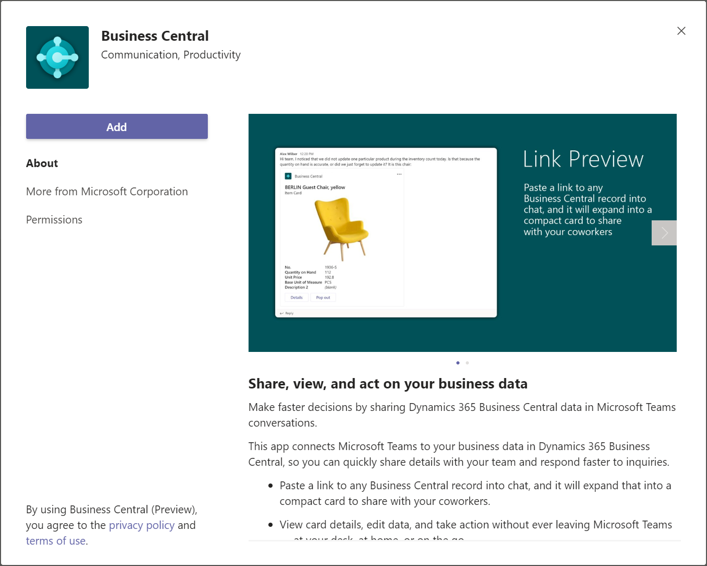

# Instalace aplikace [!INCLUDE [prod_short](includes/prod_short.md)] pro Microsoft Teams

[!INCLUDE [online_only](includes/online_only.md)]

V tomto článku se dozvíte, jak nainstalovat aplikaci [!INCLUDE [prod_short](includes/prod_short.md)] pro [Microsoft Teams](https://www.microsoft.com/microsoft-teams/). Aplikace je dostupná na Teams marketplace a můžete ji používat s webovou, desktopovou nebo mobilní aplikací Teams.

> [!NOTE]
> Your administrator may have set things up so that the app is automatically installed for you. To check whether the app is installed, open Teams, then choose **Apps**. Search for **Business Central**, then choose it when you find it. If you see **Open** on the **Business Central** page, the app is already installed.

## Předpoklady

- Je vyžadován online uživatelský účet [!INCLUDE [prod_short](includes/prod_short.md)] pro [!INCLUDE [prod_short](includes/prod_short.md)] pro Teams.

   Pokud si nejste jisti, zda máte účet nebo neznáte přihlašovací údaje pro přihlášení, obraťte se na správce společnosti, který Vám pomůže začít.

- Přístup k desktopové aplikaci Teams nebo v prohlížeči. Nemůžete nainstalovat [!INCLUDE [prod_short](includes/prod_short.md)] pomocí aplikace Teams pro telefony.

- Zásady vaší organizace musí umožňovat instalaci aplikace v Microsoft Teams.

## Přidání aplikace Business Central do Teams

There are three ways to install the Business Central app:

**Option 1: From a link**

Tato možnost je nejrychlejší způsob instalace aplikace.

1. Kliknětě na odkaz: [https://teams.microsoft.com/l/app/84c2de91-84e8-4bbf-b15d-9ef33245ad29](https://teams.microsoft.com/l/app/84c2de91-84e8-4bbf-b15d-9ef33245ad29).

2. Počkejte, až se zobrazí aplikace Business Central.

   

3. Vyberte **Přidat**.

**Option 2: From Teams**

1. Otevřete a přihlaste se k Teams.
2. Na levé straně vyberte **Aplikace**.
3. Vyhledejte **Business Central**.
4. Choose the app when you find it.
5. Choose **Add**.

> [!TIP]
> If you paste a link to a Business Central page into a Team conversation, and you don't have the app installed, you'll get a message like: **Business Central wants to show a preview of this link.** To install the app, select **Show Preview** and follow the instructions.

**Option 3: From Business Central**

1. Open Business Central.
2. Choose the  icon, enter **Get the Business Central app for Teams**, and then choose the related link.
3. Choose **Get the app from store**.
4. Wait for Teams to open and the Business Central app to appear, then choose **Add**.

> [!NOTE]
> With either option, you may be asked to sign in to [!INCLUDE [prod_short](includes/prod_short.md)]. Vyberte odkaz k **přihlášení** a podle pokynů zadejte přihlašovací jméno a heslo pro [!INCLUDE [prod_short](includes/prod_short.md)].

## Další krok

Teď jste připraveni použít aplikaci v Teams k vyhledávání kontaktů nebo sdílení záznamů Business Central. Pro více informací navštivte [Hledání zákazníků, dodavatelů a dalších kontaktů v Microsoft Teams](across-search-contacts-teams.md) nebo [Sdílení záznamů v Microsoft Teams](across-working-with-teams.md).

## Viz také

[Business Central and Microsoft Teams Integration Overview](across-teams-overview.md)  
[Teams FAQ](teams-faq.md)  
[Troubleshooting Teams](admin-teams-troubleshooting.md)  
[Changing Company and Other Settings in Teams](across-teams-settings.md)  
[Developing for Teams Integration](/dynamics365/business-central/dev-itpro/developer/devenv-develop-for-teams)

## [!INCLUDE[prod_short](includes/free_trial_md.md)]

[!INCLUDE[footer-include](includes/footer-banner.md)]