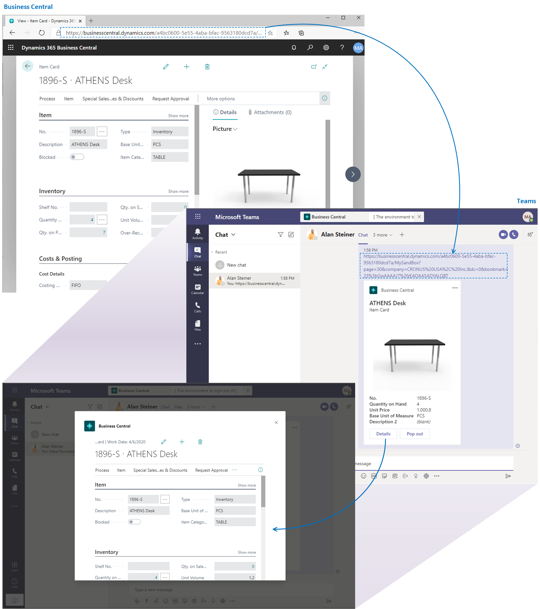
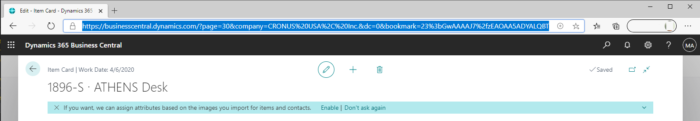
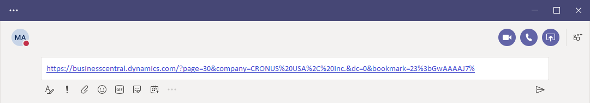

# Sharing Business Central Records and Page Links in Microsoft Teams

[!INCLUDE [online_only](includes/online_only.md)]

[!INCLUDE [prod_short](includes/prod_short.md)] offers a couple ways to share data from Business Central directly in a Microsoft Teams conversation:

<!-- 
## Overview
In this article, you'll learn how to use the app to share [!INCLUDE [prod_short](includes/prod_short.md)] records, like a customer, sales order, or invoice, with coworkers in a Teams conversation.
The [!INCLUDE [prod_short](includes/prod_short.md)] app lets you:
[!INCLUDE [prod_short](includes/prod_short.md)] offers an app that connects Microsoft Teams to your business data in [!INCLUDE [prod_short](includes/prod_short.md)], so you can quickly share details across team members and respond faster to inquiries. In this article, you'll learn how to use the app to share [!INCLUDE [prod_short](includes/prod_short.md)] records, like a customer, sales order, or invoice, with coworkers in a Teams conversation.

-->
- With the [!INCLUDE [prod_short](includes/prod_short.md)] app installed in Teams, you can include an interactive card of Business Central record in a Teams conversation.

<!--   Copy a link from any Business Central record, like a customer or sales order, then paste the link into a Teams conversation. The app connects Microsoft Teams to your business data in [!INCLUDE [prod_short](includes/prod_short.md)]. It then expands the link into a compact, interactive card that displays information about the record. Once in the conversation, you and coworkers can view more details about the record, edit data, and take action&mdash;without leaving Teams.

  -->

- With or without the [!INCLUDE [prod_short](includes/prod_short.md)] app installed, you can share a link from pages in Business Central to a Teams conversation.

   <!-- -->

The following sections describe the different ways in detail.

## Include and view a Business Central card in a Teams conversation

With the Business Central app for Teams, you can copy a link from any Business Central record, like a customer or sales order, and paste the link into a Teams conversation. The app connects Microsoft Teams to your business data in [!INCLUDE [prod_short](includes/prod_short.md)]\. It then expands the link into a compact, interactive card that displays information about the record. Jakmile jste v konverzaci,  tak vy a vaši spolupracovníci můžete zobrazovat další podrobnosti o záznamu, upravit data a podniknout kroky - aniž byste opustili Teams.

### Předpoklady

- Máte přístup do Microsoft Teams.
- Nainstalovali jste aplikaci [!INCLUDE [prod_short](includes/prod_short.md)] v Teams. Více informací naleznete v [Instalace aplikace [!INCLUDE [prod_short](includes/prod_short.md)] pro Microsoft Teams](across-install-app-for-teams.md)

> [!NOTE]
> Všichni účastníci konverzace v Teams si budou moci prohlédnout karty záznamů Business Central, které do konverzace odešlete. Chcete-li zobrazit více podrobností o záznamech pomocí **Detaily** nebo **Vyskakovacího okna** na katě, musíte mít přístup do [!INCLUDE [prod_short](includes/prod_short.md)]. Pro více informací navštivte [Správa integrace Microsoft Teams](admin-teams-integration.md#minimum-requirements-1).

### Zahrnutí karty Business Central do konverzace Teams

1. Přihlašte se do [!INCLUDE [prod_short](includes/prod_short.md)] pomocí Vašeho prohližeče.
2. Otevřete záznam, který chcete sdílet.

   The app is designed to display card type pages from [!INCLUDE [prod_short](includes/prod_short.md)]\. Otevřete stránku, která zobrazuje jeden záznam, například Zboží, Zákazníka nebo Pprodejní objednávku. Nelze jej použít pro centra rolí nebo stránky, které zobrazují několik záznamů v seznamu.

3. Zkopírujte celou adresu URL z adresního řádku prohlížeče.

   
4. Přejděte do Teams a začněte konverzaci, pomocí které můžete chatovat s osobou, skupinou osob nebo týmovám kanálem.

   <!--Teams imposes a few limitations here eg. you cannot unfurl a link during a Voice/Video call :/ We should probably only mention this in a Troubleshooting section (and i hope it will also be fixed soon)-->
5. Vložíte URL adresu do okna se zprávou, kde ji píšete.

   
6. Při prvním vložení odkazu do konverzace budete požádáni, abyste se přihlásili k [!INCLUDE [prod_short](includes/prod_short.md)] a udělili aplikaci souhlas k načtení dat. Postupujte podle pokynů na obrazovce.

   > [!NOTE]
   > Tento krok budete muset udělat pouze jednou.

7. Chvilku počkejte, než se karta vygeneruje v okně se zprávou.

8. Když se karta zobrazí, před odesláním zprávy pečlivě zkontrolujte její obsah, zda neobsahuje citlivé informace. Tento krok je důležitý, protože jakmile zprávu odešlete, všichni v konverzaci kartu uvidí.

9. Pokud karta vypadá dobře, pomocí **Odeslat** ji přidáte do konverzace.

   > [!TIP]
   > Jakmile se karta objeví a před tím, než zvolíte **Send** můžete smazat URL, které jste vložili.

10. Chcete-li zobrazit další podrobnosti nebo provést změny záznamu zobrazeném na kartě, vyberte možnost **Podrobnosti**. Další informace naleznete v následující části.

### Zobrazení podrobností karty

Po odeslání karty do konverzace mohou všichni účastníci se [správnými oprávněními](admin-teams-integration.md#permissions) vybrat **Detaily** a otevřít okno, které zobrazuje další informace o záznamu a případně provést změny záznamu. Nezáleží na tom, jestli jste ten, kdo kartu posílá, nebo ten, kdo kartu přijímá. Funkce **Podrobnosti** je obzvláště užitečná pro příjemce, protože jim rychle poskytuje stručné a cílené informace o záznamu, na rozdíl od toho, že musí zobrazovat celý záznam.

Okno podrobností je podobné tomu, co byste viděli v záznamu [!INCLUDE [prod_short](includes/prod_short.md)]. Ale pro Teams je to trošku ořezáné. Až dokončíte prohlížení a provádění změn, zavřete okno a vraťte se do konverzace Teams.

Při práci s údaji na kartě je na paměti několik věcí:

- To open the card details, users must have permission on the page and its data in [!INCLUDE [prod_short](includes/prod_short.md)]\.
- Karty v chatu Teams se automaticky neaktualizují podle změn. Any changes you save to a record in the details window are saved in [!INCLUDE [prod_short](includes/prod_short.md)]\. Karta v Teams nezobrazí změn v konverzaci, dokud nevložíte odkaz znovu.

Další informace o práci s kartami a jejich údaji naleznete v [Teams FAQ](teams-faq.md).

## Share a link to page from Business Central to Teams

Directly from most collection pages, like the **Items** page, and details pages, like the **Items** card, you can send a link to the page to specific recipients in a Teams conversation. For example, you can share a link to a filtered view of your records. Recipients can then select the link to open the page in [!INCLUDE [prod_short](includes/prod_short.md)]\.

### Předpoklady
Máte přístup do Microsoft Teams.

### Share a link

1. In [!INCLUDE [prod_short](includes/prod_short.md)]\, open the page that you want to share.
2. At the top of the page, choose the  icon, then **Share to Teams**.
3. If you're asked, sign in to Teams with your user name and password.
4. In the **Share to Teams** page, type a name of a person, group, or channel that you want send the message to.
5. The message box will include a link to the page. Add any more information if you like, then choose **Share**.
6. The link has now been shared. If you want to go to the conversation, choose **Go to Teams**.

## Viz také

[Business Central and Microsoft Teams Integration Overview](across-teams-overview.md)  
[Install the [!INCLUDE [prod_short](includes/prod_short.md)] App for Microsoft Teams](across-install-app-for-teams.md)  
[Teams FAQ](teams-faq.md)  
[Searching for Customers, Vendors, and Other Contacts from Microsoft Teams](across-search-contacts-teams.md)  
[Changing Company and Other Settings in Teams](across-teams-settings.md)  
[Troubleshooting Teams](admin-teams-troubleshooting.md)  
[Developing for Teams Integration](/dynamics365/business-central/dev-itpro/developer/devenv-develop-for-teams)

## [!INCLUDE[prod_short](includes/free_trial_md.md)]

[!INCLUDE[footer-include](includes/footer-banner.md)]