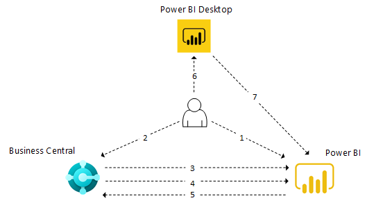

# Integrace komponent Power BI a přehledu architertur pro [!INCLUDE[prod_short](includes/prod_short.md)]

V tomto článku se dozvíte o různých aspektech integrace Power BI s [!INCLUDE[prod_short](includes/prod_short.md)], čo vám pomůže pochopit jeho implementaci a použití.

## Komponenty

Následující tabulka popisuje hlavní komponenty, které jsou součástí integrace Power BI.

| Komponenta | Popis |
|---------|-----------|
| Power BI | Cloudová služba pro hostování a správu sestav. |
| Power BI Desktop | Vývojový nástroj pro vytváření sestav a řídicích panelů, který umožňuje spouštět sestavy. Je k dispozici ke stažení zdarma v Microsoft Store a je nainstalován lokálně. |
| [!INCLUDE[prod_short](includes/prod_short.md)] | Online nebo lokální řešení s konektory vystavenými Power BI a možností vložit část Power BI. |

## Co je k dispozici od začátku

Následující tabulka popisuje dostupné funkce.

| Funkce | Podpora [!INCLUDE[prod_short](includes/prod_short.md)] online nebo on-premises |
|-------|---------------------|
| Konektory Power BI | Oba Různé konektory pro online a on-premises. Stejný konektor používaný pro Power BI Desktop a Power BI Service |
| Vložené prostředí pro zobrazení dané sestavy uvnitř okna s faktami v [!INCLUDE[prod_short](includes/prod_short.md)] | Oba Vyžaduje konfiguraci pro zobrazení sestav pro prostředí on-premises. |
| Správa sestav Power BI od [!INCLUDE[prod_short](includes/prod_short.md)] | Online |
| Výchozí sestavy Power BI o centrech rolí nasazených do Power BI | Online |
| Aplikace Power BI na Microsoft AppSource | Online |

## Architektura

[!INCLUDE[prod_short](includes/prod_short.md)] se integruje s Power BI prostřednictvím konektoru pomocí OData. Zdroj dat pro sestavy Power BI je vystaven jako stránky API a webové služby OData.

:::image type="content" source="./media/power-bi-architecture.png" alt-text="Image alt text." lightbox="./media/power-bi-architecture.png":::

Starting in February 2022, Power BI reports for [!INCLUDE[prod_short](includes/prod_short.md)] online are sourced from a secondary, read-only database replica. The database replica is part of the [read scale-out](/dynamics365/business-central/dev-itpro/administration/database-read-scale-out-overview) capability in [!INCLUDE[prod_short](includes/prod_short.md)] online. This configuration frees up the main database for transactions, which enhances performance of the system. Connecting to the read-only database replica is an integral part of the Business Central online connector, and requires no extra setup on your part. All new reports will connect to the read-only database replica by default. Old reports will still use the main database. For more information, see [Business Central 2021 Release Wave 2 Plan](/dynamics365-release-plan/2021wave2/smb/dynamics365-business-central/use-secondary-read-only-database-power-bi-reporting).

## Obecný tok

Následující diagram znázorňuje základní workflow pro uživatele při připojování [!INCLUDE[prod_short](includes/prod_short.md)] do Power BI.

1. Uživatel se zaregistruje k účtu Power BI.
2. Uživatel se připojuje k Power BI z [!INCLUDE[prod_short](includes/prod_short.md)].
3. [!INCLUDE[prod_short](includes/prod_short.md)] ověřuje licenci.
4. [!INCLUDE[prod_short](includes/prod_short.md)] nasadí výchozí sestavy do služby Power BI. Tento krok se děje pouze pro [!INCLUDE[prod_short](includes/prod_short.md)] online.
5. [!INCLUDE[prod_short](includes/prod_short.md)] zpřístupní sestavy v Power BI pro výběr v [!INCLUDE[prod_short](includes/prod_short.md)]. Výchozí sestavy se automaticky zobrazují v částech Power BI.
6. Uživatel vytvoří sestavu v Power BI Desktop.
7. Uživatel publikuje sestavu do služby Power BI. Sestavy jsou pak k dispozici pro výběr v [!INCLUDE[prod_short](includes/prod_short.md)].

## Podívejte se na související školení na webu [Microsoft Learn](/learn/modules/configure-powerbi-excel-dynamics-365-business-central/index)

## Viz také

[Business Central and Power BI](admin-powerbi.md)  
[Power BI for consumers](/power-bi/consumer/end-user-consumer)  
[The 'new look' of the Power BI service](/power-bi/service-new-look)  
[Quickstart: Connect to data in Power BI Desktop](/power-bi/desktop-quickstart-connect-to-data)  
[Power BI documentation](/power-bi/)  
[Business Intelligence](bi.md)  
[Getting Ready for Doing Business](ui-get-ready-business.md)  
[Importing Business Data from Other Finance Systems](across-import-data-configuration-packages.md)  
[Setting Up [!INCLUDE[prod_short](includes/prod_short.md)]](setup.md)  
[Use [!INCLUDE[prod_short](includes/prod_short.md)] as a Power BI Data Source](across-how-use-financials-data-source-powerbi.md)  
[Use [!INCLUDE[prod_short](includes/prod_short.md)] as a Power Apps Data Source](across-how-use-financials-data-source-powerapps.md)  
[Use [!INCLUDE[prod_short](includes/prod_short.md)] in Power Automate](across-how-use-financials-data-source-flow.md)

[!INCLUDE[footer-include](includes/footer-banner.md)]