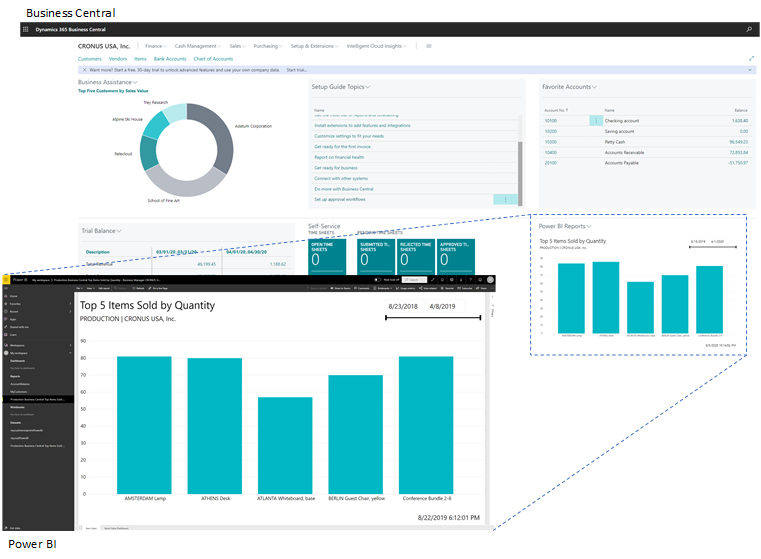

# [!INCLUDE[prod_short](includes/prod_short.md)] a Power BI

Získání přehledu o vašich datech [!INCLUDE[prod_short](includes/prod_short.md)] je snadné pomocí [Power BI](https://powerbi.microsoft.com) - systému vizualizace dat od společnosti Microsoft. Power BI načte data [!INCLUDE[prod_short](includes/prod_short.md)], která vám umožní vytvářet řídicí panely a sestavy na základě těchto dat. Power BI poskytuje flexibilní alternativu k sestavám, které jsou zabudované v [!INCLUDE[prod_short](includes/prod_short.md)], což vám umožní přejít k podrobnostem a přizpůsobit vizualizaci a dokonce sloučit data z různých společností v [!INCLUDE[prod_short](includes/prod_short.md)]. Některé sestavy Power BI lze také vložit do Business Central a zobrazit bez opuštění systému. Složitější řídicí panely je lépe spouštět z webu Power BI.

## Co můžete dělat s Power BI a [!INCLUDE[prod_short](includes/prod_short.md)]

Existují různé funkce pro práci s [!INCLUDE[prod_short](includes/prod_short.md)] a Power BI. Některé věci můžete dělat z Power BI, zatímco jiné se dělají z [!INCLUDE[prod_short](includes/prod_short.md)]. Některé funkce jsou k dispozici pouze s [!INCLUDE[prod_short](includes/prod_short.md)] online, nikoli on-premises. V následující tabulce je uveden přehled.

| Funkce | Popis | Online | On-premises | Více informací |
|-------|-----------|--------------|-----------|----------------|
| Zobrazení dat [!INCLUDE[prod_short](includes/prod_short.md)] v Power BI | Data si můžete prohlédnout z [!INCLUDE[prod_short](includes/prod_short.md)] v sestavách v Power BI. [!INCLUDE[prod_short](includes/prod_short.md)] online zahrnuje některé předdefinované sestavy Power BI. Nebo vám vaše organizace zpřístupní některé vlastní sestavy. |  |  | [Viz...](across-working-with-business-central-in-powerbi.md) |
| Zobrazení sestavy Power BI v klientovi [!INCLUDE[prod_short](includes/prod_short.md)] | Sestavy Power BI, které zobrazují data [!INCLUDE[prod_short](includes/prod_short.md)], mohou být vloženy přímo do částí stránek [!INCLUDE[prod_short](includes/prod_short.md)]. Přepnutím součásti zobrazíte libovolnou sestavu, která je vám k dispozici. |  | [*](#onprem) | [Viz...](across-working-with-powerbi.md) |
| Vytváření sestavy a řídicího paneu v Power BI, které zobrazují [!INCLUDE[prod_short](includes/prod_short.md)] | Pomocí Power BI Desktop můžete vytvářet vlastní sestavy a řídicí panely. Sestavy můžete publikovat do své vlastní služby Power BI nebo je sdílet s ostatními ve vaší organizaci. |  |  | [Viz...](across-how-use-financials-data-source-powerbi.md) |
| [!INCLUDE[prod_short](includes/prod_short.md)] aplikace v Power BI | [!INCLUDE[prod_short](includes/prod_short.md)] publikuje tři aplikace pro Power BI na Microsoft AppSource. Tyto aplikace vytvářejí podrobné sestavy a řídicí panely ve službě Power BI pro prohlížení dat [!INCLUDE[prod_short](includes/prod_short.md)]. Mezi dostupné aplikace patří: <ul><li>[!INCLUDE [prod_long](includes/prod_long.md)] - CRM </li><li>[!INCLUDE [prod_long](includes/prod_long.md)] - Finance </li><li>[!INCLUDE [prod_long](includes/prod_long.md)] - Prodej </li></ul> |  | [Viz...](across-powerbi-business-central-apps.md) |

<a name="onprem">*</a> Tato funkce vyžaduje registrovanou aplikaci pro Business Central v Microsoft Azure. Pro více informací navštivte [Registrace Business Central On-Premises ve službě Azure AD pro integraci s jinými službami](/dynamics365/business-central/dev-itpro/administration/register-app-azure).

## Připravte se na používání Power BI

Než začnete používat Power BI s [!INCLUDE[prod_short](includes/prod_short.md)], je třeba provést několik úkolů. <!-- Some of the tasks are typically only done by administrators or super users.--> The tasks will depend on your role in your organization, and what you want to do with Power BI:

- As a *business user*, you want to view Power BI reports, either in the Power BI Service or in Business Central
- As an *administrator*, you're responsible for the management of the organization-wide settings that control how Business Central and Power BI work.
- As a *report creator*, you want to build custom Power BI reports that you can share with other users.

| Task | Business user | Administrator | Report creator | Více informací |
|----|-------------|-------------|-----------------------|----------------|
| Získejte účet Power BI. |  |  |  | Go to [https://powerbi.microsoft.com](https://powerbi.microsoft.com). K přihlášení k účtu použijte svou pracovní e-mailovou adresu a heslo.   Sign-up requires that you have a license, but in most cases you should already have a free license, For more information, see [Power BI Licensing](admin-powerbi-setup.md#license). |
| Get Power BI Desktop |  | To download, go to [Power BI Desktop](https://powerbi.microsoft.com/desktop/). Pro více informací navštivte [Získat Power BI Desktop](/power-bi/fundamentals/desktop-get-the-desktop). |
| Expose Business Central data to Power BI |  |  | [Expose data through API pages or OData web services](admin-powerbi-setup.md#exposedata) |
| Enable Power BI integration (on-premises only) |  | [Set up Business Central on-premises for Power BI integration](admin-powerbi-setup.md#setup) |

<!--

1. If you're using [!INCLUDE[prod_short](includes/prod_short.md)] on-premises, make sure your deployment meets the requirements outlined in [Set up [!INCLUDE[prod_short](includes/prod_short.md)] on-premises for Power BI integration](admin-powerbi-setup.md#setup). This task is typically an administrative task.

2. Expose Business Central data through API pages or published web services.

    Business Central online automatically included several pages as APIs. For more information, see [Business Central API V2.0](/dynamics365/business-central/dev-itpro/api-reference/v2.0/). Application developers for Business Central online can create custom API pages that you can then consume in reports. For more information, see [Developing a Custom API](/dynamics365/business-central/dev-itpro/developer/devenv-develop-custom-api).

   Codeunit, page, and query objects can be published as OData web services. There are many web services published by default. An easy way to find the web services is to search for *web services* in [!INCLUDE[prod_short](includes/prod_short.md)]. For more information about publishing web services, see [Publish a Web Service](across-how-publish-web-service.md).

3. Get a Power BI account.

   To do anything with Power BI and [!INCLUDE[prod_short](includes/prod_short.md)], whether you're an administrator or just a consumer, you'll need Power BI service account. To get an account, go to [https://powerbi.microsoft.com](https://powerbi.microsoft.com). To sign up for an account, use your work email address and password. Sign-up requires that you have a license, but in most cases you should already have a free license. For more information, see [Power BI Licensing](admin-powerbi-setup.md#license).

4. If you want to create your own Power BI reports, get Power BI Desktop.

   You can download [Power BI Desktop](https://powerbi.microsoft.com/desktop/). For more information, see [Get Power BI Desktop](/power-bi/fundamentals/desktop-get-the-desktop).

-->

## Podívejte se na související školení na webu [Microsoft Learn](/learn/modules/configure-powerbi-excel-dynamics-365-business-central/index)

## Viz také

[Power BI for consumers](/power-bi/consumer/end-user-consumer)  
[The 'new look' of the Power BI service](/power-bi/service-new-look)  
[Quickstart: Connect to data in Power BI Desktop](/power-bi/desktop-quickstart-connect-to-data)  
[Power BI documentation](/power-bi/)  
[Business Intelligence](bi.md)  
[Getting Ready for Doing Business](ui-get-ready-business.md)  
[Importing Business Data from Other Finance Systems](across-import-data-configuration-packages.md)  
[Setting Up [!INCLUDE[prod_short](includes/prod_short.md)]](setup.md)  
[Use [!INCLUDE[prod_short](includes/prod_short.md)] as a Power BI Data Source](across-how-use-financials-data-source-powerbi.md)  
[Use [!INCLUDE[prod_short](includes/prod_short.md)] as a Power Apps Data Source](across-how-use-financials-data-source-powerapps.md)  
[Use [!INCLUDE[prod_short](includes/prod_short.md)] in Power Automate](across-how-use-financials-data-source-flow.md)

[!INCLUDE[footer-include](includes/footer-banner.md)]