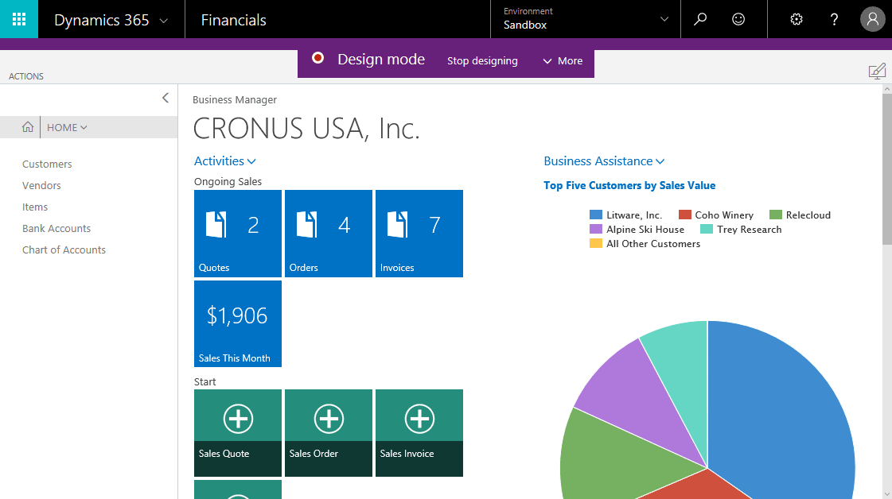

# Sandboxová prostředí v [!INCLUDE[prod_short](includes/prod_short.md)]

S [!INCLUDE[prod_short](includes/prod_short.md)] online, můžete snadno získat bezpečné prostředí, kde můžete testovat, školit nebo řešit problémy, aniž byste narušili pracovní procesy nebo obchodní data vaší společnosti. Takové neprodukční prostředí se nazývá *sandbox*. Izolované od produkce, sandboxové prostředí je místem, kde můžete bezpečně prozkoumávat, učit se, předvádět, vyvíjet a testovat službu bez rizika ovlivnění dat a nastavení vašeho produkčního prostředí.

> [!TIP]
> Dostali jste se na tento článek poté, co jste v horní liště vybrali název svého prostředí [!INCLUDE [prod_short](includes/prod_short.md)]? V současné době nelze tímto způsobem změnit název nebo prostředí. Místo toho musíte požádat svého správce o změnu názvu nebo požádat o sdílení odkazu na jiné prostředí.

Váš správce spravuje sandboxová prostředí v [Admin center](/dynamics365/business-central/dev-itpro/administration/tenant-admin-center-environments?toc=/dynamics365/business-central/toc.json).

Pokud například chcete vytvořit sandbox pro srovnávací testy, může správce vytvořit vyhrazené prostředí v admin centre. Pro více informací navštivte [Produkce a prostředí Sandbox](/dynamics365/business-central/dev-itpro/administration/environment-types) v obsahu pro vývojáře a správu.

Sandboxy můžete také bezpečně používat pro školení, například pro sledování výukové cesty z [Microsoft Learn](/learn/dynamics365/business-central?WT.mc_id=dyn365bc_landingpage-docs), protože je to bezpečné prostředí pro experimentování. Pokud se něco pokazí, prostě smažete sandbox a začnete znovu.

Jakmile budete hotovi, můžete sandbox odebrat pomocí admin center.

> [!NOTE]
> Technicky se prostředí sandbox velmi liší od produkčního prostředí. Váš správce může vytvořit sandbox, který obsahuje produkční data, ale stále je to sandbox a nemůžete například požádat o export databáze. Pro více informací navštivte [Sandboxová prostředí](/dynamics365/business-central/dev-itpro/administration/environment-types#sandbox-environments) v obsahu pro vývojáře a správu.

Sandboxové prostředí je v neposlední řadě užitečné, protože obsahuje několik užitečných funkcí:

* [Pokročilé uživatelské prostředí](#advanced-user-experience)
<!--* [Complete sample data](#complete-sample-data)  -->
* [Návrhář](#designer)

## Pokročilé uživatelské prostředí

Je možné povolit a vyzkoušet plnou funkčnost standardní verze [! INCLUDE[prod_short](includes/prod_short.md)] do sandboxového tenanta nastavením pole **Zkušenost** na stránce **Informace o společnosti** na *Premium*. Stránku **Informace o společnosti** najdete v nabídce :::image type="content" source="media/ui-experience/settings_icon_small.png" alt-text="Ikona nastavení."::: menu.

Po aktivaci uživatelského prostředí *Premium* získáte přístup ke všem standardním profilům (rolím) a centrům rolí ve standardní verzi. Případně se obraťte na prodejního partnera pro předvedení možností. Pro více informací navštivte [Jak najdu prodejního partnera?](across-faq.yml#how-do-i-find-a-reselling-partner).

### Kompletní ukázková data

V situacích, kdy potřebujete další ukázková data, se obraťte na svého prodejního partnera.
<!-- In the sandbox environment, you can also create a new company with the **Advanced Evaluation - Complete Sample Data** option so that you can take training or step through walkthroughs that require additional sample data, such as [Walkthrough: Receiving and Putting Away in Basic Warehouse Configurations](walkthrough-receiving-and-putting-away-in-basic-warehousing.md).   -->

<!--#### To create a company with complete sample data in a sandbox

1. Choose the  icon, enter **Companies**, and then choose the related link.  
2. Choose the **New** action, and then choose **Create New Company**.  
3. In the **Assisted Setup for Creating a Company** page, choose **Next**.  
4. Specify a name for the new company, and then, in the **Select the data and setup to get started** field, choose **Advanced Evaluation - Complete Sample Data**.  
5. Complete the rest of the assisted setup guide.  

When the assisted setup guide completes, you can start exploring the new company with the complete sample data. For more information, see [Creating New Companies in [!INCLUDE[prod_short](includes/prod_short.md)]](about-new-company.md).  -->

## Návrhář

V sandboxovém prostředí najdete **Návrháře** povolené. Návrháře můžete aktivovat výběrem ikony návrhu  na stránce nebo výběrem položky nabídky **Návrh** v  Nabídky nastavení.

Pro více informací navštivte [Použití Návrháře](/dynamics365/business-central/dev-itpro/developer/devenv-inclient-designer) v obsahu pro vývojáře a správce (pouze v angličtině).

<!--  -->

## Viz také

[Work with [!INCLUDE[prod_short](includes/prod_short.md)]](ui-work-product.md)  
[[!INCLUDE[prod_long](includes/prod_long.md)] Trials and Subscriptions]((/dynamics365/business-central/dev-itpro/administration/trials-subscriptions)  
[Managing Environments in the Business Central administration center](/dynamics365/business-central/dev-itpro/administration/tenant-admin-center-environments)  
[Production and Sandbox Environments](/dynamics365/business-central/dev-itpro/administration/environment-types)

[!INCLUDE[footer-include](includes/footer-banner.md)]
