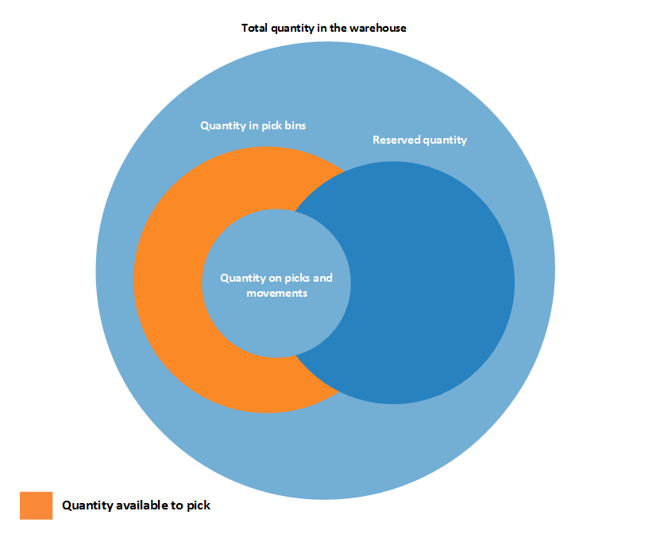
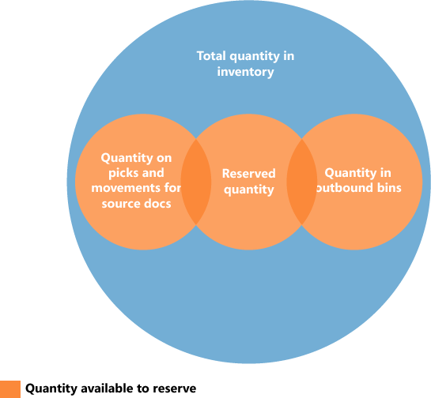

# Detaily návrhu: Skladová dostupnost
Systém musí udržovat stálou kontrolu nad dostupností zboží ve skladu, aby odchozí objednávky mohl efektivně proudit a poskytovat optimální dodávky.

Dostupnost se liší v závislosti na alokacích na úrovni přihrádek, když dochází k činnostem skladu, jako jsou vyskladnění a přesuny, když systém rezervace ukládá omezení, která je třeba dodržovat. Poměrně složitý algoritmus ověřuje, že jsou splněny všechny podmínky před přidělením množství vyskladnění pro odchozí dodávky.

Pokud není splněna jedna nebo více podmínek, mohou se zobrazit různé chybové zprávy, včetně obecné zprávy "Není co zpracovat". The "Nothing to handle." message can occur for many different reasons, both in outbound and inbound flows, where a directly or indirectly involved document line contains the **Qty. to Handle** field.

> [!NOTE]
> Brzy zde budou zveřejněny informace o možných důvodech hlášky „Není co řešit.“

## Obsah přihrádky a rezervace
V každé instalaci správy skladu existuje množství zboží jako položky skladu, v oblasti aplikace Sklad, tak jako položky zboží v oblasti zásob. Tyto dva typy položek obsahují různé informace o tom, kde položky existují a zda jsou k dispozici. Položky skladu definují dostupnost zboží podle přihrádky a typu přihrádky, který se nazývá obsah přihrádky. Položky zboží definují dostupnost zboží podle jeho rezervace k odchozím dokladům.

V algoritmu vyskladnění existují zvláštní funkce pro výpočet množství, které je k dispozici k vyskladnění, když je obsah přihrádky spojen s rezervacemi.

## Dostupné množství k vyskladnění
Pokud například algoritmus vyskladnění nezváží množství zboží, které je rezervováné pro čekající dodávku prodejní objednávky, může být toto zboží vyskladněno pro jinou prodejní objednávku, která je dodána dříve, což brání splnění prvního prodeje. Aby se zabránilo této situaci, algoritmus vyskladnění odečte množství, která jsou vyhrazena pro jiné výstupní doklady, množství v existujících dokladech vyskladnění a množství, která jsou vyskladněna, ale ještě nebyla dodána nebo spotřebována.

The result is displayed in the **Available Qty. to Pick** field on the **Pick Worksheet** page, where the field is calculated dynamically. Hodnota se také vypočítá, když uživatelé vytvoří vyskladnění přímo pro výstupní doklady. Such outbound documents could be sales orders, production consumption, or outbound transfers, where the result is reflected in the related quantity fields, such as **Qty. to Handle**.

> [!NOTE]  
> Pokud jde o prioritu rezervací, množství k rezervaci se odečte od množství, které je k dispozici k výběru. Pokud je například množství dostupné v přihrádce vyskladnění 5 jednotek, ale 100 jednotek je v přihrádce zaskladnění, pak při pokusu o rezervaci více než 5 jednotek pro jinou objednávku se zobrazí chybová zpráva, protože dodatečné množství musí být k dispozici v přihrádce vyskladnění.

### Výpočet množství, které je k dispozici k vyskladnění
Množství, které je k dispozici k vyskladnění se vypočítá takto:

dostupné množství k vyskladnění = množství ve vyskladňovacích přihrádkách - množství na vyskladnění a přesunech – (rezervované množství ve vyskladňovacích přihrádkách + rezervované na vyskladnění a přesnech)

Následující diagram ukazuje různé prvky výpočtu.

## Množství dostupné k rezervaci
Vzhledem k tomu, že koncept obsahu přihrádky a rezervace existují společně, musí být množství zboží, které je k dispozici k rezervaci, přiřazeno ve výstupních dokladech skladu.

Mělo by být možné rezervovat všechny položky ve skladu s výjimkou těch, u které byla zaháje expedice. Proto je množství, které je k dispozici k rezervaci, definováno jako množství ve všech dokladech a ve všech typech přihrádek, s výjimkou následujících výstupních množství:

- Množství na nezapsaných dokladech vyskladnění
- Množství v dodacích přihrádkách
- Množství v přihrádkách pro výrobu
- Množství v přihrádkách dílny
- Množství v přihrádkách montážr
- Množství v adjustačních přihrádkách

The result is displayed in the **Total Available Quantity** field on the **Reservation** page.

On a reservation line, the quantity that cannot be reserved, because it is allocated in the warehouse, is displayed in the **Qty. Allocated in Warehouse** field on the **Reservation** page.

### Výpočet dostupného množství k rezervaci
Množství dostupné k rezervaci se vypočítá takto:

dostupné množství k rezervaci = celkové množství zásob - množství na vyskladnění a přesunech ze zdrojových dokladů - rezervované množství - množství v odhozích přihrádkách

Následující diagram ukazuje různé prvky výpočtu.

## Viz také
[Design Details: Warehouse Management](design-details-warehouse-management.md)  
[View the Availability of Items](inventory-how-availability-overview.md)

[!INCLUDE[footer-include](includes/footer-banner.md)]