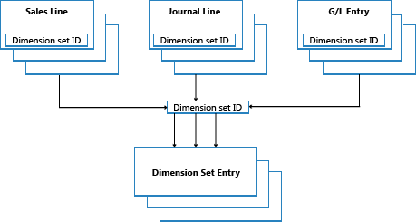

# Přehled položek sad dimenzí
This topic describes how dimension set entries are stored and posted in [!INCLUDE[prod_short](includes/prod_short.md)].

## Sady dimenzí
Sada dimenzí je jedinečná kombinace hodnot dimenzí. Je uložena jako položky sady dimenzí v databázi. Každá položka sady dimenzí představuje jednu hodnotu dimenze. Sada dimenzí je identifikována společným ID sady dimenzí, které je přiřazeno každé položce sady dimenzí, která patří do sady dimenzí.

Následující příklad ukazuje sadu dimenzí, která má tři položky sady dimenzí. Sada dimenzí je identifikována ID sady dimenzí, což je 108.

| ID sady dimenzí | Kód dimenze | Kód hodnoty dimenze | Název hodnoty dimenze |
|----------------------|--------------------|--------------------------|--------------------------|  
| 108 | AREA | 70 | Severní Amerika |
| 108 | BUSINESSGROUP | HOME | Domácí |
| 108 | DEPARTMENT | SALES | Prodej |

## Položky sady dimenzí
Dimension sets are stored in the **Dimension Set Entry** table as dimension set entries with the same dimension set ID.

Když vytvoříte nový řádek deníku, hlavičku dokladu nebo řádek dokladu, můžete zadat kombinaci hodnot dimenze. Namísto explicitního ukládání každé hodnoty dimenze v databázi je k řádku deníku, hlavičce dokladu nebo řádku dokladu přiřazeno ID sady dimenzí k určení sady dimenzí.

When you edit and close the **Edit Dimension Set Entries** page, a check is performed to see whether the combination of dimension values exists as a dimension set in the table. Pokud k kombinaci dojde v tabulce, bude odpovídající ID sady dimenzí přiřazeno řádku deníku, hlavičce dokladu nebo řádku dokladu. V opačném případě je do tabulky přidána nová sada dimenzí a nové ID sady dimenzí je přiřazeno řádku deníku, hlavičce dokladu nebo řádku dokladu.

## Codeunita 408 Správa dimenzí
Codeunita 408, Správa dimenzí, je knihovna funkcí, která zpracovává běžné úkoly, které souvisejí s dimenzemi, jako je kopírování z jedné tabulky do druhé nebo z jednoho dokumentu do druhého.

## Zlepšení výkonu
Uložením sad dimenzí jednou v databázi se zachová databázový prostor a zlepší se celkový výkon.

## Viz také
[Design Details: Searching for Dimension Combinations](design-details-searching-for-dimension-combinations.md)   
[Design Details: Table Structure](design-details-table-structure.md)   
[Design Details: Dimension Set Entries](design-details-dimension-set-entries.md)

[!INCLUDE[footer-include](includes/footer-banner.md)]
