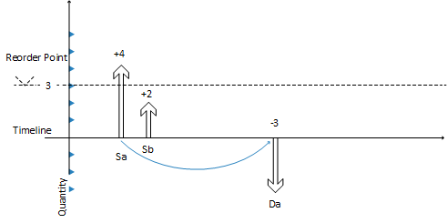
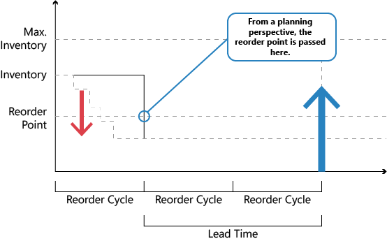
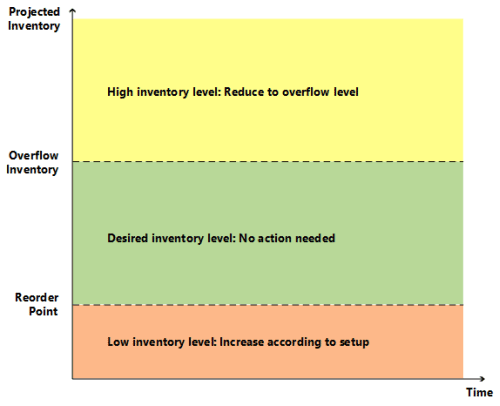
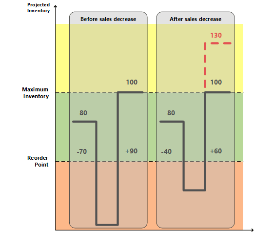
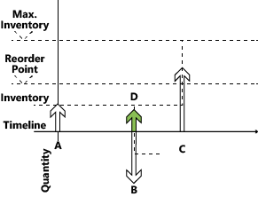

# Detaily návrhu: Zpracování způsobu přiobjednání
Aby se zboží mohlo účastnit plánování zásobování, musí být definován způsob přiobjednání. Existují následující čtyři způsob přiobjednání:

* Pevné přiobj.množ.
* Maximální množství
* Pořadí
* Dávka-pro-dávku

Pevné přiobj.množ. a Maximální množství zásady se týkají plánování zásob. Ačkoli je plánování zásob technicky jednodušší než postup vyvažování, musí tyto zásady existovat společně s postupným vyvažováním nabídky a sledování objednávek. Aby bylo možné řídit integraci mezi těmito dvěma možnostmi a zajistit viditelnost v zapojené logice plánování, řídí přísné zásady způsob, jakým jsou zásady přeuspořádání zpracovávány.

## Role bodu přiobjednání
Kromě obecného vyvážení nabídky a poptávky musí plánovací systém také sledovat úrovně zásob u dotčených položek, aby respektoval definované způsoby přiobjednání

Bod přiobjednání představuje poptávku během doby realizace. Když projektovaná zásoba projde pod úroveň zásob definovanou bodem přiobjednání, je na čase objednat větší množství. Mezitím se očekává, že se zásoby budou postupně snižovat a pravděpodobně dosáhnou nuly (nebo úrovně pojistné zásoby), dokud nedojde k doplnění.

V souladu s tím plánovací systém navrhne dopředu naplánovanou zakázku na dodávku v okamžiku, kdy projektovaný inventář projde pod bodem přiobjednání zásob.

Bod přiobjednání odráží určitou úroveň zásob. Úrovně zásob se však mohou během časového intervalu výrazně měnit, a proto musí plánovací systém neustále sledovat předpokládané dostupné zásoby.

## Sledování předpokládané úrovně zásob a bodu přiobjednání
Zásoby jsou typem nabídky, ale pro plánování zásob systém plánování rozlišuje mezi dvěma úrovněmi zásob:

* Předpokládané zásoby
* Plánované dostupné zásoby

### Plánované zásoby
Zpočátku jsou předpokládané zásoby množstvím hrubých zásob, včetně nabídky a poptávky v minulosti, i když nebyly zaúčtovány, při zahájení procesu plánování. V budoucnu se z tohoto stane pohyblivá projektovaná úroveň zásob, která je udržována hrubými množstvími z budoucí nabídky a poptávky, protože jsou zaváděny podél časové osy (ať už rezervované nebo jiným způsobem alokované).

Projektované zásoby používají plánovací systém ke sledování bodu přiobjednání a k určení množství přiobjednávky při použití maximálního množství způsobu přiobjednání.

### Očekávané dostupné zásoby
Očekávané dostupné zásoby jsou součástí plánovaných zásob, které jsou v daném okamžiku k dispozici pro splnění poptávky. Očekávané dostupné zásoby jsou používány plánovacím modulem při sledování úrovně pojistných zásob.

Očekávané dostupné zásoby jsou používány plánovacím systémem ke sledování úrovně pojistných zásob, protože pojistné zásoby musí být vždy k dispozici, aby sloužily neočekávané poptávce.

### Intervaly dostupnosti
Přísná kontrola předpokládaného inventáře je zásadní pro zjištění, kdy je dosažen nebo překročen bod přiobjednání a pro výpočet správného množství objednávky při použití maximálního množství způsobu přiobjednání.

Jak již bylo uvedeno dříve, předpokládaná úroveň zásob se vypočítá na začátku plánovacího období. Jedná se o hrubou úroveň, která nebere v úvahu rezervace a podobné příděly. K monitorování této úrovně zásob během plánovací sekvence, systém monitoruje agregované změny za určité časové období, interval dostupnosti. Systém zajišťuje, že interval dostupnosti je alespoň jeden den, protože se jedná o nejpřesnější jednotku času pro událost poptávky nebo nabídky.

### Stanovení předpokládané úrovně zásoby
Následující pořadí popisuje, jak je určena předpokládaná úroveň zásob:

* Pokud byla událost nabídky, například nákupní objednávka, zcela naplánována, zvýší se předpokládané zásoby k datu splatnosti.
* Pokud byla událost poptávky plně uspokojena, nebudou předpokládané zásoby ihned snižovány. Místo toho zaúčtuje připomenutí snížení, což je interní záznam, který obsahuje datum a množství příspěvku do předpokládaného inventáře.
* Když je naplánována následná událost nabídky a umístěna na časovou linii, budou se po aktualizaci prozkoumávaná zveřejněná připomenutí poklesu po plánovaném datu nabídky prošetřována jedna po druhé. Během tohoto procesu může být dosažena nebo překročena úroveň bodu změny pořadí interního připomenutí zvýšení.
* Pokud je zavedena nová objednávka dodávky, systém zkontroluje, zda je zadána před aktuální nabídkou. Pokud je, nová nabídka se stane současnou nabídkou a vyvažovací procedura začíná znovu.

Následující obrázek znázorňuje tento princip:

1. Nabídka **Sa** s 4 (pevná) uzavírá poptávku **Da** z -3.
2. ZavřítPoptávku: Vytvoření upomínky snížení o -3 (není ukázáno).
3. Nabídka **Sa** je uzavřena s přebytkem 1 (již neexistuje žádná poptávka).

   Tím se zvýší úroveň předpokládaných zásob na +4, zatímco předpokládané **dostupné** zásoby budou mít stav -1.

4. Další nabídka **Sb** s 2 (další objednávka), byla již umístěna na časovou osu.
5. Systém zkontroluje, zda je před **Sb** nějaké připomenutí poklesu (není, takže není podniknuta žádná akce).
6. Systém uzavře nabídku **Sb** (neexistuje žádná poptávka)—buď A: snížením ji na 0 (zrušení) nebo B: ponecháním tak, jak je.

   Tím se zvýší předpokládaná úroveň zásob (A: +0 => +4 nebo B: +2 = +6).

7. Systém provede závěrečnou kontrolu: Existuje nějaká připomínka snížení? Ano, je tam jedna na datum **Da**.
8. Systém přidá připomenutí poklesu o -3 na předpokládanou úroveň zásob, buď A: +4 -3 = 1 nebo B: +6 -3 = +3.
9. V případě A, systém vytvoří dopředu naplánovanou objednávku počínaje datem **Da**.

   V případě B je dosaženo bodu přiobjednání a je vytvořena nová objednávka.

## Role Intervalu dostupnosti
Účelem intervalu dostupnosti je shromáždit události poptávky v časové stránce, aby bylo možné vytvořit společnou objednávku dodávky.

Pro způsoby přiobjednávání, které používají bod přiobjednávání, můžete definovat interval dostupnosti. Tím je zajištěno, že se poptávka ve stejném časovém období hromadí před kontrolou dopadu na předpokládané zásoby a zda byl předán bod přiobjednání. Pokud je bod přiobjednání předán, je nová objednávka dodávky naplánována dopředu od konce období definovaného intervalem dostupnosti. Intervaly dostupnosti začínají datem zahájení plánování.

Koncept intervalu dostupnosti odráží manuální proces kontroly úrovně zásob častěji než u každé transakce. Uživatel musí definovat frekvenci (interval dostupnosti). Uživatel například shromažďuje všechny potřeby zboží od jednoho dodavatele k vytvoření týdenní objednávky.

Časový interval se obvykle používá, aby se zabránilo kaskádovému efektu. Například vyvážená řada poptávky a nabídky, kde je zrušena předčasná poptávka nebo je vytvořena nová. Výsledkem by bylo, že každá objednávka dodávky (kromě té poslední) je přeplánována.

## Pobyt pod úrovní přetečení
Při použití Maximálního množství a způsob Pevného přiobj.množ., systém plánování se zaměřuje pouze na předpokládané zásoby v daném časovém intervalu. To znamená, že plánovací systém může navrhnout nadbytečnou nabídku, když dojde k negativní poptávce nebo pozitivní změny nabídky mimo daný časový interval. Pokud je z tohoto důvodu navržena nadbytečná dodávka, plánovací systém vypočítá, na jaké množství by měla být dodávka snížena (nebo zrušena), aby se zabránilo nadbytečné nabídce. Tomuto množství se říká „úroveň přetečení“. Přetečení je sděleno jako plánovací řádek s akci **Změnit množství. (Úbytek)** nebo **Zrušit** na následující varovné zprávě:

*Attention: The projected inventory [xx] is higher than the overflow level [xx] on the Due Date [xx].*

### Výpočet úrovně přetečení
Úroveň přetečení se počítá různými způsoby v závislosti na nastavení plánování.

#### Maximální množství způsob přiobjednání
Úroveň přetečení = Maximální zásoby

> [!NOTE]  
> If a minimum order quantity exists, then it will be added as follows: Overflow level = Maximum Inventory + Minimum Order Quantity.

#### Pevné přiobj.množ. způsob přiobjednání
Úroveň přetečení = Množství přiobjednání + Bod přiobjednání

> [!NOTE]  
> If the minimum order quantity is higher than the reorder point, then it will replace as follows: Overflow Level = Reorder Quantity + Minimum Order Quantity

#### Násobek objednávky
Pokud existuje násobek objednávky, pak upraví úroveň přetečení pro obě maximální množství a způsob Pevného přiobj.množ., způsobu přiobjednávání.

### Vytvoření řádku plánování s upozorněním na přetečení
Když existující nabídka způsobí, že předpokládané zásoby budou na konci časového úseku vyšší než úroveň přetečení, vytvoří se plánovací řádek. Chcete-li upozornit na potenciální nadbytečné nabídky, použijte řádek plánování s varovnou zprávou, pole **Přijmout hlášené akce** není vybráno a zpráva akce je buď Zrušit nebo Změnit množství.

#### Výpočet množství řádku plánování
Množství řádku plánování = Současné množství nabídky – (Předpokládané zásoby – Úroveň přetečení)

> [!NOTE]  
> As with all warning lines, any maximum/minimum order quantity or order multiple will be ignored.

#### Definování typu hlášení akce

- Pokud je množství řádku plánování vyšší než 0, je hlášení akce Změnit množství.
- Pokud je množství řádku plánování rovno nebo nižší než 0, pak je hlášení akce Zrušit

#### Složení varovné zprávy
V případě přetečení se na stránce **Nesledované prvky plánování** zobrazí varovná zpráva s následujícími informacemi:

- Předpokládaná úroveň zásob, která spustila upozornění
- Vypočítaná úroveň přetečení
- Datum splatnosti události nabídky

Příklad: "Předpokládané zásoby 120 jsou vyšší než úroveň přetečení 60 v 28-01-11"

### Scénář
V tomto scénáři zákazník změní prodejní objednávku ze 70 na 40 kusů mezi dvěma běhy plánování. Funkce přetečení se nastaví, aby se snížila nákup, který byl navržen pro počáteční prodejní množství.

#### Nastavení zboží

| Způsob přiobjednání | Maximální množství |
|-----------------------|------------------|  
| Maximální množství objednávky | 100 |
| Bod přiobjednání | 50 |
| Zásoby | 80 |

#### Situace před poklesem prodeje

| Událost | Změnit množství | Plánované zásoby |
|-----------|-----------------|-------------------------|  
| Den první | Žádné | 80 |
| Prodej | -70 | 10 |
| Konec intervalu dostupnosti | Žádné | 10 |
| Návrh nové nákupní objednávky | +90 | 100 |

#### Situace po poklesu prodeje

| Změna | Změnit množství | Plánované zásoby |
|------------|-----------------|-------------------------|  
| Den první | Žádné | 80 |
| Prodej | -40 | 40 |
| Nákup | +90 | 130 |
| Konec intervalu dostupnosti | Žádné | 130 |
| Návrh snížení nákupní   objednávky z 90 na 60 | -30 | 100 |

#### Výsledné řádky plánování
Jeden řádek plánování (upozornění) je vytvořen pro snížení nákupu z 30 na 90 do 60, aby se předpokládané zásoby udržely na 100 podle úrovně přetečení.

> [!NOTE]  
> Without the Overflow feature, no warning is created if the projected inventory level is above maximum inventory. To by mohlo způsobit nadbytečnou zásobu 30.

## Zpracování předpokládaných negativních zásob
Bod přiobjednání vyjadřuje očekávanou poptávku během doby realizace zboží. Když je předán bod přiobjednávání, je čas objednat více. Předpokládané zásoby však musí být dostatečně velké, aby pokryly poptávku, dokud nebude přijata nová objednávka. Mezitím by se měly pojistné zásoby postarat o výkyvy v poptávce až na cílenou úroveň služeb.

V důsledku toho systém plánování považuje za stav nouze, pokud budoucí poptávka nemůže být doručena z předpokládaných zásob nebo vyjádřena jiným způsobem tak, že předpokládaná zásoba jde do záporu. Systém řeší takovou výjimku tím, že navrhuje novou objednávku dodávky, aby uspokojil část poptávky, kterou nelze uspokojit zásobami nebo jinou nabídkou. Velikost objednávky nové objednávky dodávky nebude brát v úvahu maximální zásobu nebo objednané množství, ani nebude brát v úvahu modifikátory objednávky, Maximální obj.množství, Minimální obj.množství a Násobek objednávky. Místo toho bude odrážet přesný nedostatek.

Řádek plánování pro tento typ objednávky dodávky zobrazí ikonu nouzového varování a při vyhledávání budou poskytnuty další informace, které uživatele informují o situaci.

Na následujícím obrázku nabídka D představuje nouzový příkaz k úpravě pro negativní zásoby.

1. Nabídka**A**, počáteční předpokládané zásoby, je pod bodem přiobjednáním.
2. Vytvoří se nová dopředu naplánovaná dodávka (**C**).

   (Množství = Maximální zásoby – Předpokládaná úroveň zásob)
3. Nabídka **A** je uzavřena poptávkou **B**, která není plně pokrytá.

   (Poptávka **B** by se mohla pokusit naplánovat Nabídku C ale to se podle konceptu intervalu dostupnosti nestane).
4. Nová nabídka (**D**) je vytvořena tak, aby pokryla zbývající množství na vyžádání poptávky **B**.
5. Poptávka **B** je uzavřena (vytvoření připomenutí předpokládaných zásob).
6. Nová nabídka **D** je uzavřena.
7. Předpokládané zásoby jsou zkontrolovány ; bod přiobjednání nebyl překročen.
8. Nabídka **C** je uzavřena (neexistuje žádná další poptávka).
9. Závěrečná kontrola: Neexistují žádné nevyřízené upomínky na úrovni zásob.

> [!NOTE]  
> Step 4 reflects how the system reacts in versions earlier than Microsoft Dynamics NAV 2009 SP1.

Tím se uzavírá popis hlavních zásad týkajících se plánování zásob na základě způsobu přiobjednání. Následující část popisuje vlastnosti čtyř podporovaných zásad způsobu přiobjednání.

## Způsob přiobjednání
Zásady přiobjednání definují, kolik má být objednáno, když je třeba zboží doplnit. Existují následující čtyři různé způsoby přiobjednání.

### Pevné přiobj.množ.
Způsob Pevného přiobj.množ. souvisí s plánováním zásob typických položek zboží skupiny C (nízké náklady na zásoby, nízké riziko zastarávání, mnoho položek). Tato zásada se obvykle používá v souvislosti s bodem přiobjednání, který odráží očekávanou poptávku během doby realizace položky.

#### Vypočet podle intervalu dostupnosti
Pokud plánovací systém zjistí, že v daném intervalu dostupnosti (cyklus přiobjednání) byl dosažen nebo překročen bod přiobjednání - nad nebo v bodě přiobjednání na začátku období a pod nebo v bodě přiobjednání na konci období - navrhne vytvoření nové objednávky dodávky zadaného přiobjednavacího množství a naplánování dopředu od prvního data po konci intervalu dostupnosti

Koncept bodu přiobjednání snižuje počet návrhů nabídky. To odráží manuální proces častého procházení skladem, aby se zkontroloval skutečný obsah v různých zásobnících.

#### Vytvoří pouze nezbytnou nabídku
Před navržením nové objednávky dodávky, která splní bod přiobjednání, plánovací systém zkontroluje, zda již byla objednána dodávka v rámci dodací lhůty zboží. Pokud stávající objednávka na dodávku vyřeší problém tím, že během doby realizace přivede projektované zboží do bodu přiobjednání nebo nad něj, systém nenavrhne novou objednávku na dodávku.

Objednávky dodávek, které jsou vytvořeny konkrétně za účelem splnění bodu přiobjednání, jsou vyloučeny z běžného vyvažování dodávek a nebudou v žádném případě následně měněny. V důsledku toho, pokud má být zboží používající bod přiobjednání vyřazeno (nedoplněno), je vhodné ručně zkontrolovat nevyřízené objednávky dodávek nebo změnit způsob přiobjednání na Dávka pro dávku, čímž systém sníží nebo zruší nadbytečnou dodávku.

#### Kombinace s Modifikátory objednávky
Modifikátory objednávek, minimální množství objednávky, maximální množství objednávky a násobek objednávky, by neměly hrát velkou roli, když se použijí zásady pevného přiobjednání množství. Plánovací systém však stále bere v úvahu tyto modifikátory a sníží množství na zadané maximální množství objednávky (a vytvoří dva nebo více nabídek za účelem dosažení celkového množství objednávky), zvýší objednávku na zadané minimální množství objednávky nebo zaokrouhlí množství objednávky nahoru, aby splnilo zadaný násobek objednávky.

#### Kombinace s kalendáři
Před navržením nové objednávky dodávky ke splnění bodu přiobjednání systém plánování zkontroluje, zda je objednávka naplánována na nepracovní den, podle všech kalendářů, které jsou definovány v poli **Kód základního kalendáře** na stránkách **Informace o společnosti** a **Karta umístění.**

Pokud je naplánovaným dnem nepracovní den, plánovací systém přesune objednávku dopředu na nejbližší pracovní datum. To může mít za následek objednávku, která splňuje bod přiobjednání, ale nesplňuje určitou specifickou poptávku. Pro takovou nevyváženou poptávku vytváří plánovací systém další nabídku.

#### Nemělo by být užíváno s prognózou
Protože očekávaná poptávka je již vyjádřena na úrovni bodu přiobjednání, není nutné zahrnout prognózu do plánování zboží pomocí bodu přiobjednání. Pokud je důležité založit plán na prognóze, použijte zásady dávky-pro-dávku

#### Nesmí být použito s rezervacemi
Pokud uživatel rezervoval množství, například množství v zásobách, pro nějakou vzdálenou poptávku, bude plánovací základna narušena. I když je plánovaná úroveň zásob přijatelná s ohledem na bod přiobjednání, množství nemusí být kvůli k dispozici. Systém se to může pokusit kompenzovat vytvářením objednávek výjimek; u položek, které jsou plánovány pomocí bodu přiobjednání, se však doporučuje nastavit pole Rezervovat na Nikdy na zboží.

### Maximální množství
Zásada Maximální množství je způsob, jak udržovat zásoby pomocí bodu přiobjednání

Vše, co se týká zásady Pevné přiobj.množ. se také vztahuje i na tyto zásady. Jediným rozdílem je množství navrhované nabídky. Při použití zásady maximálního množství bude objednané množství definováno dynamicky na základě předpokládané úrovně zásob, a proto se obvykle liší od objednávky k objednávce.

#### Vypočet podle intervalu dostupnosti
Množství přiobjednávky se určuje v okamžiku (konec časového úseku), když plánovací systém zjistí, že byl bod přiobjednání překročen. V tomto okamžiku systém měří mezeru od aktuální předpokládané úrovně zásob až po určené maximální zásoby. Jedná se o množství, které by mělo být znovu objednáno. Systém poté zkontroluje, zda již byla objednána dodávka jinde, aby byla přijata v dodací lhůtě, a pokud ano, sníží množství nové zakázky na dodávku o již objednané množství.

Systém zajistí, aby předpokládané zásoby alespoň dosáhly úrovně bodu přiobjednání – v případě, že uživatel zapomněl zadat maximální množství zásob.

#### Kombinace s Modifikátory objednávky
V závislosti na nastavení může být nejlepší kombinovat zásady Maximálního množství s modifikátory objednávky, aby bylo zajištěno minimální množství objednávky nebo zaokrouhleno na celý počet měrných jednotek nákupu nebo ji rozdělit na více položek, jak je definováno maximálním množstvím objednávky.

### Kombinace s kalendáři
Před navržením nové objednávky dodávky ke splnění bodu přiobjednání systém plánování zkontroluje, zda je objednávka naplánována na nepracovní den, podle všech kalendářů, které jsou definovány v poli **Kód základního kalendáře** na stránkách **Informace o společnosti** a **Karta umístění.**

Pokud je naplánovaným dnem nepracovní den, plánovací systém přesune objednávku dopředu na nejbližší pracovní datum. To může mít za následek objednávku, která splňuje bod přiobjednání, ale nesplňuje určitou specifickou poptávku. Pro takovou nevyváženou poptávku vytváří plánovací systém další nabídku.

### Pořadí
V prostředí vyrobit na zakázku se zboží nakupuje nebo vyrábí výhradně k pokrytí konkrétní poptávky. Typicky se vztahuje k zboží A a motivací pro volbu způsobu přiobjednávání objednávek může být to, že poptávka není častá, dodací lhůta je zanedbatelná nebo se požadované atributy liší.

Aplikace vytvoří odkaz zakázky na zakázku, který funguje jako předběžné spojení mezi nabídkou, objednávkou dodávky nebo zásobou a poptávkou, kterou bude umořovat.

Kromě použití zásady Objednávky lze odkaz zakázky na zakázku použít při plánování následujícími způsoby:

* Při použití způsobu výroby Vyrobit na zakázku k vytvoření víceúrovňových nebo projektových výrobních zakázek (výroba potřebných komponent ve stejné výrobní zakázce).
* Při použití funkce Plánování prodejní objednávky k vytvoření výrobní zakázky z prodejní objednávky.

I když se výrobní společnost považuje za prostředí výroby na zakázku, mohlo by být nejlepší použít způsob přiobjednání Dávka pro dávku pokud jsou položky čistým standardem bez odchylek v atributech. V důsledku toho bude systém používat neplánované zásoby a shromažďuje pouze prodejní objednávky se stejným datem dodávky nebo v rámci definovaného intervalu dostupnosti.

#### Propojení zakázky na zakázku a minulá data splatnosti 
Na rozdíl od většiny sad poptávky a nabídky jsou propojené objednávky s daty splatnosti před datem zahájení plánování plně plánovány systémem. Obchodním důvodem této výjimky je, že konkrétní sady nabídky a poptávky musí být synchronizovány až po provedení. Další informace o zmrazené zóně, která se vztahuje na většinu typů poptávky a dodávek, naleznete v tématu[Vyřizování objednávek před datem zahájení plánování](design-details-balancing-demand-and-supply.md#dealing-with-orders-before-the-planning-starting-date).

### Dávka-pro-dávku
Zásada dávka-pro-dávku je nejflexibilnější, protože systém reaguje pouze na skutečnou poptávku, navíc působí na očekávanou poptávku z prognózy a hromadných objednávek a poté vypořádá množství objednávky na základě poptávky. Zásada dávka-pro-dávku je zaměřena na zboží A a B, kde lze přijmout zásoby, ale je třeba se jim vyhnout.

V některých ohledech zásady dávka-pro-dávku vypadá jako zásady pořadí, ale má obecný přístup ke zboží; může přijímat množství ve skladu a sdružuje poptávku a odpovídající dodávku do intervalů dostupnosti definovaných uživatelem.

Interval dostupnosti je definován na poli **Interval dostupnosti**. Systém pracuje s minimálním časovým intervalem jednoho dne, protože se jedná o nejmenší časovou měrnou jednotku na události poptávky a dodávky v systému (i když v praxi mohou být měrnou jednotkou času na výrobních zakázkách a potřebách komponenty sekundy).

Interval dostupnosti také stanoví limity, kdy by se měla stávající objednávka dodávky přeplánovat, aby vyhověla dané poptávce. Pokud dodávka leží v intervalu dostupnosti, bude přeplánována dovnitř nebo ven, aby uspokojila poptávku. V opačném případě, pokud je dříve, způsobí zbytečné hromadění zásob a měla by být zrušena. Pokud je později, bude místo toho vytvořena nová objednávka dodávky.

Pomocí této politiky je také možné definovat pojistné zásoby, aby se vyrovnaly možné výkyvy nabídky nebo uspokojila náhlá poptávka.

Vzhledem k tomu, že množství objednávky dodávky je založeno na skutečné poptávce, může mít smysl použít modifikátory objednávky: zaokrouhlit množství objednávky tak, aby splňovala zadaný násobek objednávky (nebo měrnou jednotku nákupu), zvýšit objednávku na stanovené minimální množství objednávky, nebo snížit množství na stanovené maximální množství (a vytvořit tak dvě nebo více zásob k dosažení celkového potřebného množství).

## Viz také
[Detaily návrhu: Parametry plánování](design-details-planning-parameters.md)   
[Detaily návrhu: Tabulka přiřazení plánování](design-details-planning-assignment-table.md)   
[Detaily návrhu: Centrální koncepce plánovacího systému](design-details-central-concepts-of-the-planning-system.md)   
[Detaily návrhu: Vyvažování poptávky a nabídky](design-details-balancing-demand-and-supply.md)   
[Detaily návrhu: Plánování dodávek](design-details-supply-planning.md)

[!INCLUDE[footer-include](includes/footer-banner.md)]