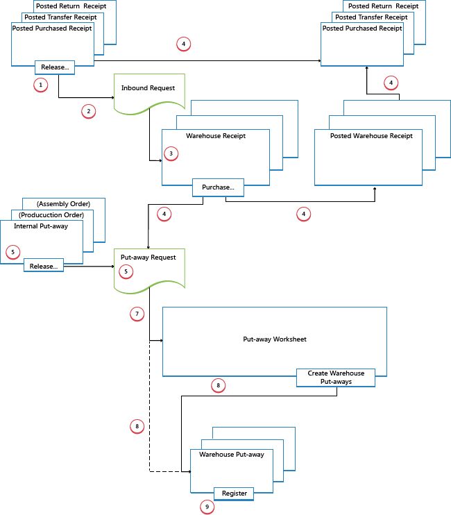

# Detaily návrhu: Vstupní procesy skladu
Vstupní procesy ve skladu začínají, když zboží dorazí do skladu v sídle společnosti, buď je přijaté z externích zdrojů, nebo z jiného sídla společnosti. Zaměstnanec zboží zaregistruje, obvykle naskenováním čárového kódu. Z přijímacího doku se skladové činnosti provádějí na různých úrovních složitosti, aby se zboží přeneslo do skladovací oblasti.

Každé zboží je identifikováno a spárováno s odpovídajícím vstupním zdrojovým dokladem. Existují následující vstupní zdrojové doklady:

- Nákupní objednávka
- Objednávka příchozího transferu
- Objednávka prodejní vratky

Kromě toho existují následující interní zdrojové doklady, které fungují jako vstupní zdroje:

- Účtování výrobní zakázka s výstupem
- Účtování montážní zakázky s výstupem

Poslední dva představují příchozí toky do skladu z interních provozních oblastí. Další informace o manipulaci se sklady pro interní příchozí a odchozí procesy najdete v [Detaily návrhu: Interní procesy skladu](design-details-internal-warehouse-flows.md).

Procesy a doklady uživatelského rozhraní v příchozích tocích skladu se liší pro základní a pokročilé konfigurace skladu. Hlavním rozdílem je, že aktivity jsou zpracovány po objednávkách v základních konfiguracích skladu a jsou konsolidovány pro více objednávek v pokročilých konfiguracích skladu. Další informace o různých úrovních složitosti skladu najdete v [Detaily návrhu: Přehled skladu](design-details-warehouse-setup.md).

V [!INCLUDE[prod_short](includes/prod_short.md)] příchozí procesy příjmu a zaskladnění lze provádět čtyřmi způsoby pomocí různých funkcí v závislosti na úrovni složitosti skladu.

| Metoda | Příchozí proces | Přihrádky | Příjmy | Vyskladnění | Úroveň složitosti (Viz [Detaily návrhu: Nastavení skladu](design-details-warehouse-setup.md)) |
|------------|---------------------|----------|--------------|----------------|--------------------------------------------------------------------------------------------------------------------|  
| A | Zaúčtujte příjemku a zaskladněte zboží z řádku objednávky | X | 2 |
| B | Zaúčtujte příjemku a zaskladněte zboží z dokladu zaskladnění zásob | X | 3 |
| C | Zaúčtujte příjemku a zaskladněte zboží z příjemky skladu | X | 4/5/6 |
| D | Zaúčtujte příjemku z příjemky skladu a zaskladnění z dokladu zaskladnění skladu | X | X | 4/5/6 |

Výběr přístupu závisí na přijatých postupech společnosti a na úrovni jejich organizační složitosti. V prostředí skladu se spracováním zboží po objednávkách, kde většina zaměstnanců skladu pracuje přímo s doklady objednávky, se společnost může rozhodnout použít metodu A. U skladu spracování zboží po objednávkách, který má složitější proces zaskladnění nebo kde jsou vyhrazení zaměstnanci skladu k provádění skladových funkcí, se může firma rozhodnout oddělit své funkce zaskladnění od dokladu objednávky, metoda B. Pro společnosti, které potřebují naplánovat zpracování více objednávek, může být užitečné použít doklady příjemky skladu, metoda C a D.

V metodách A, B a C jsou akce příjmu a zaskladnění kombinovány v jednom kroku při zaúčtování odpovídajících dokladů jako přijatých. V metodě D je příjem zaúčtován jako první, aby bylo možné rozpoznat nárůst zásob a to, že zboží je k dispozici k prodeji. Pracovník skladu poté zaregistruje zaskladnění zboží, aby bylo dostupné pro vyskladnění.

## Základní konfigurace skladu
Následující diagram znázorňuje toky vstupního skladu podle typu dokladu v základních konfiguracích skladu. Čísla v diagramu odpovídají krokům v následujících částech diagramu.

### 1: Release Source Document / Create Inventory Put-Away
When items are received in the warehouse, the user who is responsible for receiving releases the source document, such as a purchase order or an inbound transfer order, to signal to warehouse workers that the received items can be put away in inventory. Alternatively, the user creates inventory put-away documents for individual order lines, in a push fashion, based on specified bins and quantities to handle.

### 2: Create Inbound Request
When the inbound source document is released, an inbound warehouse request is created automatically. Obsahuje odkazy na typ a číslo zdrojového dokladu a není pro uživatele viditelný.

### 3: Create Inventory Put-Away
On the **Inventory Put-away** page, the warehouse worker retrieves, in a pull fashion, the pending source document lines based on inbound warehouse requests. Alternatively, the inventory put-away lines are already created, in a push fashion, by the user who is responsible for the source document.

### 4: Post Inventory Put-Away
On each line for items that have been put away, partially or fully, the warehouse worker fills in the **Quantity** field, and then posts the inventory put-away. Source documents that are related to the inventory put-away are posted as received.

Positive item ledger entries are created, warehouse entries are created, and the put-away request is deleted, if fully handled. For example, the **Quantity Received** field on the inbound source document line is updated. A posted receipt document is created that reflects the purchase order, for example, and the received items.

## Advanced warehouse configurations
The following diagram illustrates the inbound warehouse flow by document type in advanced warehouse configurations. Čísla v diagramu odpovídají krokům v následujících částech diagramu.

### 1: Vydání zdrojového dokladu
When items are received in the warehouse, the user who is responsible for receiving releases the source document, such as a purchase order or an inbound transfer order, to signal to warehouse workers that the received items can be put away in inventory.

### 2: Create Inbound Request
When the inbound source document is released, an inbound warehouse request is created automatically. Obsahuje odkazy na typ a číslo zdrojového dokladu a není pro uživatele viditelný.

### 3: Create Warehouse Receipt
On the **Warehouse Receipt** page, the user who is responsible for receiving items retrieves the pending source document lines based on the inbound warehouse request. Several source document lines can be combined in one warehouse receipt document.

The user fills in the **Qty. to Handle** field and selects the receiving zone and bin, if required.

### 4: Post Warehouse Receipt
The user posts the warehouse receipt. Positive item ledger entries are created. For example, the **Quantity Received** field on the inbound source document line is updated.

### 5: Create Warehouse Internal Put-Away
The user who is responsible for putting away from internal operations creates a warehouse internal put-away for items that have to be put away in the warehouse, such as production or assembly output. The user specifies quantity, zone, and bin from where the items should be put away, potentially with the **Get Bin Content** function. The user releases the warehouse internal put-away, which creates an inbound warehouse request so that the task can be retrieved in warehouse put-away documents or in the put-away worksheet.

### 6: Create Put-away Request
When the inbound source document is posted, a warehouse put-away request is created automatically. Obsahuje odkazy na typ a číslo zdrojového dokladu a není pro uživatele viditelný. Depending on the setup, output from a production order also creates a put-away request to put the finished items away in inventory.

### 7: Generate Put-away Worksheet Lines (Optional)
The user who is responsible for coordinating put-aways retrieves warehouse put-away lines in the **Put-away Worksheet** based on posted warehouse receipts or internal operations with output. The user selects the lines to be put-away and prepares the put-aways by specifying which bins to take from, which bins to place in, and how many units to handle. The bins may be predefined by the setup of the warehouse location or operation resource.

When all put-aways are planned and assigned to warehouse workers, the user generates the warehouse put-away documents. Fully assigned put-aways lines are deleted from the **Put-away Worksheet**.

> [!NOTE]  
> If the **Use Put-away Worksheet** field is not selected on the location card, then warehouse put-away documents are created directly based on posted warehouse receipts. In that case, step 7 is omitted.

### 8: Create Warehouse Put-away Document
The warehouse worker who performs put-aways creates a warehouse put-away document in a pull fashion, based on the posted warehouse receipt. Alternatively, the warehouse put-away document is created and assigned to a warehouse worker in a push fashion.

### 9: Register Warehouse Put-Away
On each line for items that have been put away, partially or fully, the warehouse worker fills in the **Quantity** field on the **Warehouse Put-away** page, and then registers the warehouse put-away.

Warehouse entries are created, and the warehouse put-away lines are deleted, if fully handled. The warehouse put-away document remains open until the full quantity of the related posted warehouse receipt is registered. **Množství Put Away** field on the warehouse receipt order lines is updated.

## Viz také
[Detaily návrhu: Správa skladu](design-details-warehouse-management.md)

[!INCLUDE[footer-include](includes/footer-banner.md)]