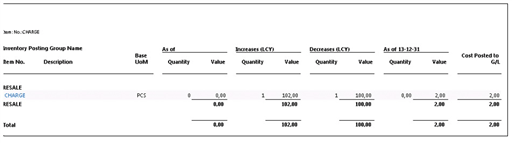

# Datum zaúčtování adjustace položky ocenění ve srovnání se zdrojovým záznamem

Tento článek porovnává dzúčtovací datum u adjustace položky ocenění s datem účtování u položky, což způsobuje spuštění dávkové úlohy Úprava nákladů - položky zboží, zejména scénář přecenění a scénář nákladů na zboží.

Dávková úloha **Úprava nákladů - položky zboží** zpracuje vaše data v závislosti na vašem scénáři a konfiguraci [!INCLUDE[prod_short](includes/prod_short.md)]. V této části popisujeme dva samostatné procesy a pro každý z nich ukazujeme typ dopadu, který má dávková úloha Úprava nákladů - položky zboží na data.

## Scénář přecenění

### Předpoklady

Zadejte následující hodnoty:

**Nastavení zásob**

- Automatické účtování nákladů=Ano

- Automatická adjustace nákladů=Vždy

- Typ výpočtu prům.poř. ceny=Zboží

- Období průměrných nákladů=Den

**Nastavení financí**

- Povolit účtování od = 1. leden 2021

- Povolit účto do = prázdné

**Nastavení uživatelů**:

- Povolit účtování od = 1. prosinec 2020.

- Povolit účto do = prázdné

### Testování scénáře

Otestujte tento scénář provedením následujících kroků.

1. Vytvořte **Položku** s názvem TEST s následujícími hodnotami:

   - Základní měrná jednotka = KS

   - Metoda ocenění = Průměrná

   - Vyberte volitelné účto skupiny.

2. Otevřete **Deníky zboží**, vytvořte novou položku a zaúčtujte řádek následujícím způsobem:

   - Zúčtovací datum = 15. prosinec 2020

   - Zboží = TEST

   - Typ položky = Nákup

   - Množství = 100

   - Jednotková cena = 10

3. Otevřete **Deníky zboží**, vytvořte novou položku a zaúčtujte řádek následujícím způsobem:

   - Datum = 20. prosince 2020

   - Zboží = TEST

   - Typ položky = záporná úprava

   - Množství = 2

4. Otevřete **Deníky zboží**, vytvořte novou položku a zaúčtujte řádek následujícím způsobem:

   - Datum = 15. leden 2021

   - Zboží = TEST

   - Typ položky = záporná úprava

   - Množství = 3

5. Otevřete **Deník přecenění zboží**, vytvořte novou položku a zaúčtujte řádek následujícím způsobem:

   - Zboží = TEST

   - Vyrovnává položku = vyberte položku nákupu zaúčtovanou v kroku 2. Datum zaúčtování přecenění bude stejné jako položka, kterou upraví.

   - Pořizovací cena (přeceněná) = 40

Byly zaúčtovány následující položky **Položka zboží** a **Položky ocenění**:

**Položka zboží - nákup**:

| Číslo položky | Číslo zboží | Zúčtovací datum | Typ položky | Číslo dokladu | Množství | Částka nákladů (skutečná) | Zbývající množství |
|---------|---------|---------|---------|---------|---------|---------|---------|
| 317 | TEST | 2020-12-15 | Nákup | T00001 | 100 | 4000 | 95 |

**Položky ocenění**

| Číslo položky | Číslo zboží | Zúčtovací datum | Číslo položky zboží | Typ položky zboží | Typ položky | Číslo dokladu | Množství čísla položky zboží | Částka nákladů (skutečná) | Náklady zaúčtované do Hlavní finančí knihy | Adjustace | Vyrovnává položku | Zdrojový kód |
|---------|---------|---------|---------|---------|---------|---------|---------|---------|---------|---------|---------|---------|
| 376 | TEST | 2020-12-15 | 317 | Nákup | Přímé náklady | T00001 | 100 | 1 000,00 | 1 000,00 | Ne | 0 | ITEMNL |
| 379 | TEST | **2020-12-15** | 317 | Nákup | Přecenění | T04002 | 0 | 3 000,00 | 3 000,00 | Ne | 0 | REVALINL |

**Položka zboží - negativní úprava, krok 3**

| Číslo položky | Číslo zboží | Zúčtovací datum | Typ položky | Číslo dokladu | Množství | Částka nákladů (skutečná) | Zbývající množství |
|---------|---------|---------|---------|---------|---------|---------|---------|
| 318 | TEST | 2020-12-20 | Negatívní úprava. | T00002 | -2 | -80 | 0 |

**Položky ocenění**

| Číslo položky | Číslo zboží | Zúčtovací datum | Číslo položky zboží | Typ položky zboží | Typ položky | Číslo dokladu | Množství čísla položky zboží | Částka nákladů (skutečná) | Náklady zaúčtované do Hlavní finančí knihy | Adjustace | Vyrovnává položku | Zdrojový kód |
|---------|---------|---------|---------|---------|---------|---------|---------|---------|---------|---------|---------|---------|
| 377 | TEST | 2020-12-20 | 318 | Negatívní úprava. | Přímé náklady | T00002 | -2 | -20 | -20 | Ne | 0 | ITEMNL |
| 380 | TEST | **2021-01-01** | 318 | Negatívní úprava. | Přímé náklady | T04002 | 0 | -60 | -60 | Ano | 377 | INVTADAMT |

**Položka zboží - negativní úprava, krok 4**

| Číslo položky | Číslo zboží | Zúčtovací datum | Typ položky | Číslo dokladu | Množství | Částka nákladů (skutečná) | Zbývající množství |
|---------|---------|---------|---------|---------|---------|---------|---------|
| 319 | TEST | 2021-01-15 | Negatívní úprava. | T00003 | -3 | -120 | 0 |

**Položky ocenění**

| Číslo položky | Číslo zboží | Zúčtovací datum | Číslo položky zboží | Typ položky zboží | Typ položky | Číslo dokladu | Množství čísla položky zboží | Částka nákladů (skutečná) | Náklady zaúčtované do Hlavní finančí knihy | Adjustace | Vyrovnává položku | Zdrojový kód |
|---------|---------|---------|---------|---------|---------|---------|---------|---------|---------|---------|---------|---------|
| 378 | TEST | 2021-01-15 | 319 | Negatívní úprava. | Přímé náklady | T00003 | -3 | -30 | -30 | Ne | 0 | ITEMNL |
| 381 | TEST | **2021-01-15** | 319 | Negatívní úprava. | Přímé náklady | T04003 | 0 | -90 | -90 | Ano | 378 | INVTADAMT |

Dávková úloha **Úprava nákladů - položky zboží** rozpoznala změnu nákladů a upravila záporné adjustace.

**Kontrola zúčtovacího data u vytvořených adjustovaných položek ocenění:** Nejbližší povolené zúčtovací datum, ke kterému se dávková úloha Adjustace nákladů položek zboží musí vztahovat, je 1. ledna 2021, jak je uvedeno v nastavení financí.

**Záporná adjustace v kroku 3:** přiřazené datum zaúčtování je 1. ledna, poskytnuté nastavením financí. Datum zaúčtování položky ocenění v rozsahu adjustace je 20. prosinec 2020. Podle nastavení financí datum není v povoleném rozsahu období účtování. Proto je adjustaci položky ocenění přiřazeno datum zaúčtování uvedené v poli Povolit účto od v nastavení financí.

**Záporná úprava v kroku 4:** přiřazené zúčtovací datum je 15. ledna. Položka ocenění v rozsahu adjustace má zúčtovací datum 15. ledna, které je v povoleném rozsahu zúčtovacího data podle nastavení financí.

Adjustace provedené pro negativní úpravu v kroku 3 způsobí diskusi. Příznivé datum zaúčtování pro adjustaci položky ocenění by bylo 20. prosince nebo alespoň do konce prosince, protože v prosinci bylo zaúčtováno přecenění způsobující změnu NNPZ.

Chcete-li v prosinci dosáhnout adjustaci záporné úpravy v kroku 3, musí být v nastavení financí, pole Povolit účto od nastaveno na datum v prosinci.

### Závěr

Se zkušenostmi získanými v tomto scénáři můžete při zvažování nejvhodnějšího nastavení pro povolené období účtování pro společnost zvážit následující. Pokud povolíte zaúčtování změn hodnoty zásob v období, jako je v tomto případě prosinec, nastavení, které společnost používá pro povolená období účtování, by mělo být v souladu s tímto rozhodnutím. Nastavení pole Povolit účto od v Nastavení financí s uvedením 1. prosince by umožnilo předání přehodnocení provedené v prosinci ovlivněným výstupním položkám ve stejném období.

Skupiny uživatelů, které nemají povoleno účtovat v prosinci, ale v lednu, což bylo pravděpodobně zamýšleno v tomto scénáři jako omezené nastavením financí, by měly být místo toho řešeno prostřednictvím nastavení uživatele.

## Scénář účtování poplatku za zboží:

### Předpoklady

Zadejte následující hodnoty:

**Nastavení zásob**

- Automatické účtování nákladů=Ano

- Automatická adjustace nákladů=Vždy

- Typ výpočtu prům.poř. ceny=Zboží

- Období průměrných nákladů=Den

**Nastavení financí**

- Povolit účto od = 1. prosinec 2020.

- Povolit účto do = prázdné

**Nastavení uživatelů**:

- Povolit účto od = 1. prosinec 2020.

- Povolit účto do = prázdné

### Testování scénáře

Otestujte tento scénář provedením následujících kroků.

1. Vytvořte poplatek za **Zboží** s následujícími hodnotami:

   - Základní měrná jednotka = KS

   - Metoda ocenění = Průměrná

   - Vyberte volitelné účto skupiny.

2. Vytvořte novou **Nákupní objednávku** s následujícími hodnotami:

   - Nákup od dodavatele: 10000

   - Zúčtovací datum = 15. prosinec 2020

   - Číslo faktury dodavatele: 1234

   Na řádku nákupní objednávky vyberte následující hodnoty:

   - Zboží = POPLATEK

   - Množství = 1

   - Nákupní cena = 100

   Chcete-li tento krok dokončit, zaúčtujte dokument jako přijatý a fakturovaný.

3. Vytvořte novou **Prodejní objednávku** s následujícími hodnotami:

   - Zákazník-číslo: 10000

   - Zúčtovací datum = 16. prosinec 2020

   Na řádku prodejní objednávky:

   - Zboží = POPLATEK

   - Množství = 1

   - Jednotková cena = 135

   Chcete-li tento krok dokončit, zaúčtujte dokument jako přijatý a fakturovaný.

4. Zadejte hodnoty pro stránku **Nastavení hlavní knihy**:

   - Povolit účtování od = 1. leden 2021

   - Povolit účto do = prázdné

5. Vytvořte novou **Nákupní objednávku** s následujícími hodnotami:

   - Nákup od dodavatele: 10000

   - Zúčtovací datum = 2. leden 2014

   - Číslo faktury dodavatele: 2345

   Na řádku nákupní objednávky:

   - Poplatek za zboží = JB-PŘEPRAVA

   - Množství = 1

   - Nákupní cena = 3

   - Přiřaďte Náklady zboží k nákupnímu dokladu z kroku 2.

   Chcete-li tento krok dokončit, zaúčtujte dokument jako přijatý a fakturovaný.

**Stav nákupu položky zboží krok 2**:

| Číslo položky | Číslo zboží | Zúčtovací datum | Typ položky | Číslo dokladu | Množství | Částka nákladů (skutečná) | Zbývající množství |
|---------|---------|---------|---------|---------|---------|---------|---------|
| 324 | Bez poplatku | 2020-12-15 | Nákup | 107030 | 1 | 105 | 0 |

**Položky ocenění**

| Číslo položky | Číslo zboží | Zúčtovací datum | Číslo položky zboží | Typ položky zboží | Typ položky | Číslo dokladu | Poplatek za položku č. | Množství položky zboží | Částka nákladů (skutečná) | Náklady zaúčtované do Hlavní finančí knihy | Adjustace | Vyrovnává položku |
|---------|---------|---------|---------|---------|---------|---------|---------|---------|---------|---------|---------|---------|
| 397 | Bez poplatku | 2020-12-15 | 324 | Nákup | Přímé náklady | 108029 |         | 1 | 100 | 100 | NO | 0 |
| 399 | Bez poplatku | 2021-01-02 | 324 | Nákup | Přímé náklady | 108009 | JBFREIGHT | 0 | 3 | 3 | NO | 0 |

**Stav prodeje položky zboží**:

| Číslo položky | Číslo zboží | Zúčtovací datum | Typ položky | Číslo dokladu | Množství | Částka nákladů (skutečná) | Zbývající množství |
|---------|---------|---------|---------|---------|---------|---------|---------|
| 325 | Bez poplatku | 2020-12-16 | Prodej | 102035 | -1 | -105 | 0 |

**Položky ocenění**

| Číslo položky | Číslo zboží | Zúčtovací datum | Číslo položky zboží | Typ položky zboží | Typ položky | Číslo dokladu | Poplatek za položku č. | Množství položky zboží | Částka nákladů (skutečná) | Náklady zaúčtované do Hlavní finančí knihy | Adjustace | Vyrovnává položku |
|---------|---------|---------|---------|---------|---------|---------|---------|---------|---------|---------|---------|---------|
| 398 | Bez poplatku | 2020-12-16 | 325 | Prodej | Přímé náklady | 109024 |         | -1 | -100 | -100 | NO | 0 |
| 400 | Bez poplatku | 2021-01-01 | 325 | Prodej | Přímé náklady | 109024 |         | 0 | -3 | -3 | Ano | 398 |

6. V pracovní den 3. ledna dorazí nákupní faktura obsahující dodatečný poplatek za zboží provedený v kroku 2. Tato faktura má datum dokladu 30. prosince a je proto zaúčtována s datem zaúčtování 30. prosince 2020.

   Vytvořte novou **Nákupní objednávku** s následujícími hodnotami:

   - Nákup od dodavatele: 10000

   - Zúčtovací datum = 30. prosinec 2020

   - Číslo faktury dodavatele: 3456

   Na řádku nákupní objednávky vyberte následující hodnoty:

   - Poplatek za zboží = JB-PŘEPRAVA

   - Množství = 1

   - Nákupní cena = 2

   Přiřaďte Náklady zboží k nákupnímu dokladu z kroku 2.

   Chcete-li tento krok dokončit, zaúčtujte dokument jako přijatý a fakturovaný.

**Stav nákupu položky zboží**:

| Číslo položky | Číslo zboží | Zúčtovací datum | Typ položky | Číslo dokladu | Množství | Částka nákladů (skutečná) | Zbývající množství |
|---------|---------|---------|---------|---------|---------|---------|---------|
| 324 | Bez poplatku | 2020-12-15 | Nákup | 107030 | 1 | 105 | 0 |

**Položky ocenění**

| Číslo položky | Číslo zboží | Zúčtovací datum | Číslo položky zboží | Typ položky zboží | Typ položky | Číslo dokladu | Poplatek za položku č. | Množství položky zboží | Částka nákladů (skutečná) | Náklady zaúčtované do Hlavní finančí knihy | Adjustace | Vyrovnává položku |
|---------|---------|---------|---------|---------|---------|---------|---------|---------|---------|---------|---------|---------|
| 397 | Bez poplatku | 2020-12-15 | 324 | Nákup | Přímé náklady | 108029 |            | 1 | 100 | 100 | Ne | 0 |
| 399 | Bez poplatku | 2021-01-02 | 324 | Nákup | Přímé náklady | 108030 | JBFREIGHT | 0 | 3 | 3 | Ne | 0 |
| 401 | Bez poplatku | **2020-12-30** | 324 | Nákup | Přímé náklady | 108031 | JBFREIGHT | 0 | 2 | 2 | Ne | 0 |

**Stav prodeje položky zboží**:

| Číslo položky | Číslo zboží | Zúčtovací datum | Typ položky | Číslo dokladu | Množství | Částka nákladů (skutečná) | Zbývající množství |
|---------|---------|---------|---------|---------|---------|---------|---------|
| 325 | Bez poplatku | 2020-12-16 | Prodej | 102035 | -1 | -105 | 0 |

**Položky ocenění**

| Číslo položky | Číslo zboží | Zúčtovací datum | Číslo položky zboží | Typ položky zboží | Typ položky | Číslo dokladu | Poplatek za položku č. | Množství položky zboží | Částka nákladů (skutečná) | Náklady zaúčtované do Hlavní finančí knihy | Adjustace | Vyrovnává položku |
|---------|---------|---------|---------|---------|---------|---------|---------|---------|---------|---------|---------|---------|
| 398 | Bez poplatku | 2020-12-16 | 325 | Prodej | Přímé náklady | 103024 |            | -1 | -100 | -100 | Ne | 0 |
| 400 | Bez poplatku | 2021-01-01 | 325 | Prodej | Přímé náklady | 103024 |            | 0 | -3 | -3 | Ano | 398 |
| 402 | Bez poplatku | **2021-01-01** | 325 | Prodej | Přímé náklady | 103024 |            | 0 | -2 | -2 | Ano | 398 |

Zpráva o ocenění zásob se vytiskne k datu 31. prosince 2020

**Shrnutí scénáře:**

Popsaný scénář končí zprávou Hodnoty zásob ukazující Množství = 0, zatímco Hodnota = 2. Poplatek za zboží zaúčtovaný v kroku 6 je součástí hodnoty zvýšení zásob v prosinci, zatímco pokles zásob ve stejném období není ovlivněn.

Nastavení financí, ve kterém bylo uvedeno Povolit účto od 1. ledna, byla dobrá věc pro první poplatek za zboží. Ve stejném období byly zaznamenány náklady na zvýšení i snížení zásob. U druhého poplatku za zboží však nastavení financí způsobí, že změna v NNPZ bude rozpoznána v období po.

**Závěr:**

Je výzvou získat zprávu o ocenění zásob, aby demonstrovala množství = 0, zatímco hodnota <> 0. V tomto případě je také obtížnější vyjádřit optimální nastavení, protože nákupní faktury přicházejí ve stejný den, ale řeší různá období nebo dokonce fiskální roky. Přechod do nového fiskálního roku obvykle vyžaduje určité plánování a v rámci toho je třeba vzít v úvahu pohled na proces Adjustace nákladů položek zboží rozpoznávající NNPZ.

V tomto scénáři by jednou z možností mohlo být nastavení financí, konkrétně pole Povolit účto od na datum v prosinci o několik dní později a odložit zaúčtování prvního poplatku za zboží, aby bylo možné zaúčtovat všechny náklady za předchozí období/fiskální rok, se spuštěním dávkové úlohy Adjustace nákladů položek zboží a poté přesunout povolené zúčtovací datum do nového období/fiskálního roku. První poplatek za zboží se zúčtovacím datem 2. ledna by pak mohl být zaúčtován.

## Viz také

[Detaily návrhu: Zúčtovací datum adjustace položky ocenění](design-details-inventory-adjustment-value-entry-posting-date.md)  
[Detaily návrhu: Ocenění zásob](design-details-inventory-costing.md)  
[Detaily návrhu: Vyrovnání zboží](design-details-item-application.md)

[!INCLUDE[footer-include](includes/footer-banner.md)]
