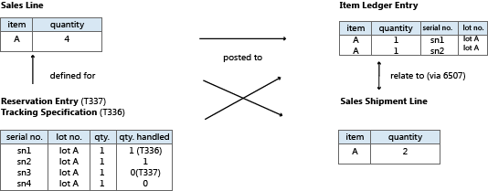

# Detaily návrhu: Design sledování zboží

Item tracking in [!INCLUDE[prod_short](includes/prod_short.md)] started with [!INCLUDE [navnow_md](includes/navnow_md.md)]. The item tracking functionality is in a separate object structure with intricate links to posted documents and item ledger entries, and it is integrated with the reservation system, which handles reservation, order tracking, and action messaging. For more information, see [Design Details: Reservation, Order Tracking, and Action Messaging](design-details-reservation-order-tracking-and-action-messaging.md) in the Supply Planning design details.

This design incorporates item tracking entries in total availability calculations throughout the system, including planning, manufacturing, and warehousing. Serial and lot numbers are applied on the item ledger entries to ensure simple access to historical data for item tracking purposes. With 2021 release wave 1, item tracking in [!INCLUDE [prod_short](includes/prod_short.md)] includes package numbers.

With the addition of serial, lot, and package numbers, the reservation system handles permanent item attributes while also handling intermittent links between supply and demand in the form of order tracking entries and reservation entries. Další odlišnou charakteristikou sériových čísel nebo čísel šarží ve srovnání s konvenčními údaji o rezervaci je skutečnost, že mohou být zaúčtovány, a to buď částečně, nebo úplně. Therefore, the **Reservation Entry** table (T337) now works with a related table, the **Tracking Specification** table (T336), which manages and displays summing across active and posted item tracking quantities. For more information, see [Design Details: Active versus Historic Item Tracking Entries](design-details-active-versus-historic-item-tracking-entries.md).

The following diagram outlines the design of item tracking functionality in [!INCLUDE[prod_short](includes/prod_short.md)].

Objekt centrálního účtování je přepracován tak, aby zpracovával jedinečnou subklasifikaci řádku dokladu ve formě sériových čísel nebo čísel šarží, a přidávají se speciální relační tabulky, které vytvářejí relace jedna k více mezi zaúčtovanými doklady a jejich položkami a hodnotami rozdělených položek položky hlavní knihy.

Codeunit 22, **Item Jnl. – Post Line**, now splits the posting according to the item tracking numbers that are specified on the document line. Každé jedinečné číslo sledování zboží na řádku vytvoří pro zboží vlastní položku zboží. To znamená, že propojení z řádku zaúčtovaného dokladu na přidružené položky zboží je nyní vztahem jedna k více. Tento vztah je zpracován následujícími tabulkami vztahů sledování zboží.

| Pole | Popis |
|---------------|---------------------------------------|  
| **Item Entry Relation** (T6507) | Spojuje dodané nebo přijaté řádky s položkami zboží. |
| **Value Entry Relation** (T6508) | Spojuje fakturované řádky s položkami ocenění. |

For more information, see [Design Details: Item Tracking Posting Structure](design-details-item-tracking-posting-structure.md).

## Viz také

[Detaily návrhu: Sledování zboží](design-details-item-tracking.md)

[!INCLUDE[footer-include](includes/footer-banner.md)]
