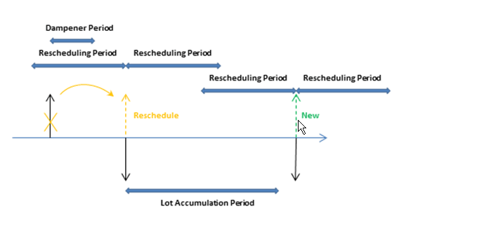
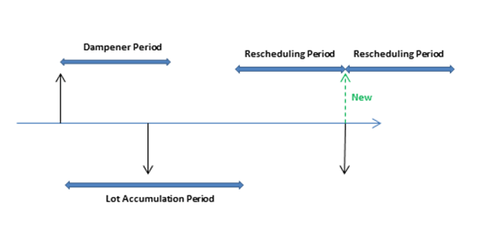

# Detaily návrhu: Parametry plánování
This topic describes the different planning parameters that you can use in [!INCLUDE[prod_short](includes/prod_short.md)].

Způsob, jakým plánovací systém řídí dodávku zboží, je určen různými nastaveními na kartě zboží nebo SKJ a nastavením ve výrobním nastavení. Následující tabulka ukazuje, jak se tyto parametry používají pro plánování.

| Účel | Parametr |
|-------------|---------------|  
| Určete, zda má být položka naplánována | Způsob přiobjednání = Prázdné |
| Definujte, kdy chcete změnit pořadí | Interval dostupnosti   bod přiobjednání  Bezpečná průběžná doba |
| Definuje kolik se má přiobjednat | Minimální zásoby   Způsob přiobjednání:   -   Pevné přiobj.množ. plus Přiobjednané množství -   Maximální množství plus Maximální zásoby -   Pořadí -   Dávka-pro-dávku |
| Optimalizujte, kdy a kolik chcete doobjednat | Období přeplánování   Období kumulace dávky   Období prodlevy |
| Upravte objednávky dodávek | Minimální množství objednávky   Maximální množství objednávky   Násobek objednávky |
| Vymezení plánovaného zboží | Způsob výroby:   -   Vyrobit-na-sklad -   Zhotovit na objednávku |

## Definujte, zda bude zboží plánované
Chcete-li do procesu plánování zahrnout zboží / SKJ, musí mít způsob přiobjednání, jinak musí být naplánována ručně, například pomocí funkce Plánování objednávek.

## Definujte, kdy přiobjednat
Nabídky na opětovné objednání se obvykle uvolní pouze v případě, že předpokládané dostupné množství kleslo na nebo pod dané množství. Toto množství je definováno bodem přiobjednání. Jinak to bude nula. Nulu lze upravit zadáním množství pojistných zásob. Pokud uživatel definoval bezpečnou průběžnou dobu, způsobí to doručení návrhu v období před požadovaným datem splatnosti.

Pole **Interval dostupnosti** je používáno bodem přiobjednání(**Pevné přiobj.množ.** a **Maximální množ.**), de se úroveň inventáře kontroluje pro každý interval dostupnosti.
 Poprvé segment začíná v den zahájení plánování.

> [!NOTE]  
> When calculating time buckets, the planning system ignores any working calendars that are defined in the **Base Calendar Code** field in the **Company Information** and **Location Card** pages.

Výchozí Bezpečná průběžná doba na stránce **Nastavení výroby**, by měla být nastavena alespoň na jeden den. Datum splatnosti poptávky může být známo, ale ne termín splatnosti. Plány plánují pozpátku, aby uspokojily hrubou poptávku, a pokud není definována žádná bezpečná průběžná doba, může zboží dorazit příliš pozdě na to, aby uspokojila poptávku.

Při určování, kdy přiobjednat, hrají roli také tři další pole **Období přeplánování**, **Období kumulace dávky** a **Období prodlevy**. Pro více informací navštivte [Optimalizujte, kdy a kolik chcete doobjednat](design-details-planning-parameters.md#optimize-when-and-how-much-to-reorder).

## Definuje kolik se má přiobjednat
Pokud plánovací systém zjistí potřebu přiobjednat, použije se zvolená způsob přiobjednání k určení, kdy a kolik je třeba objednat.

Nezávisle na zásadách přiobjednání se systém plánování obvykle řídí touto logikou:

1. Množství návrhu objednávky se vypočítá tak, aby splňovalo zadanou minimální úroveň zásob zboží, obvykle množství pojistných zásob. Pokud není uvedeno nic, minimální úroveň zásob je nula.
2. Pokud jsou předpokládané dostupné zásoby nižší než množství pojistných zásob, je navržena zpětně naplánovaná objednávka dodávky. Množství objednávky vyplní alespoň množství pojistných zásob a může být zvýšeno hrubou poptávkou v intervalu dostupnosti, způsoby přiobjednání a modifikátory objednávky.
3. Pokud jsou předpokládané zásoby na nebo pod bodem přiobjednání (počítáno z agregovaných změn v intervalu dostupnosti) a nad množstvím pojistných zásob, je doporučeno dopředu naplánované pořadí výjimek. Množství objednávky určí jak hrubou poptávku, která má být splněna, tak zásadu přiobjednání. Na minimu bude množství objednávky splňovat bod přiobjednávky.
4. Pokud je před konečným datem dopředu naplánovaného návrhu objednávky splatná větší hrubá poptávka a tato poptávka přináší aktuálně vypočítané předpokládané dostupné zásoby pod množství pojistných zásob, množství objednávky se zvýší, aby se vyrovnal schodek. Navrhovaná zakázka na dodávku je poté naplánována zpět od data splatnosti hrubé poptávky, která by porušila množství bezpečného zboží.
5. Pokud není pole **Interval dostupnosti** bude přidána pouze hrubá poptávka ke stejnému datu splatnosti..

   Následující pole bodu přiobjednání také hrají roli při definování, kolik má být přiobjednáno: **Období přeplánování**, **Období kumulace dávky**, a **Období prodlevy**. Pro více informací navštivte [Optimalizujte, kdy a kolik chcete doobjednat](design-details-planning-parameters.md#optimize-when-and-how-much-to-reorder).

### Způsob přiobjednání
Následující způsoby přiobjednání ovlivňují množství, které je přiobjednáno.

| Způsob přiobjednání | Popis |
|-----------------------|---------------------------------------|  
| **Pevné přiobj.množ.** | Na minimu bude množství objednávky rovno množství přiobjednávky To lze zvýšit, aby vyhověla poptávce nebo požadované úrovni zásob. Tato zásada přiobjednání se obvykle používá s bodem přiobjednání. |
| **Maximální množ.** | Množství objednávky bude vypočteno tak, aby splňovalo maximální zásoby. Pokud se použijí modifikátory množství, může dojít k překročení maximálního množství zásob. Nedoporučujeme používat interval dostupnosti spolu s maximálním množstvím. Interval dostupnosti bude obvykle zrušen. Tato zásada přiobjednání se obvykle používá s bodem přiobjednání. |
| **Zakázka** | Množství objednávky bude vypočítáno tak, aby splňovalo každou jednotlivou poptávkovou událost a sada nabídky a poptávky zůstane propojená až do provedení. Nezvažují se žádné plánovací parametry. |
| **Dávka-pro-dávku** | Množství se vypočítá tak, aby splňovalo součet poptávky, která je splatná v intervalu dostupnosti. |

## Optimalizujte, kdy a kolik je třeba přiobjednat
Chcete-li získat racionální plán dodávek, plánovač doladí parametry plánování, aby omezil návrhy přeplánování, akumuloval poptávku (dynamické množství přiobjednávání) nebo aby se vyhnul nevýznamným plánovacím akcím. Následující pole období přiobjebnávání pomáhá optimalizovat, kdy a kolik chcete přiobjednávat.

| Pole | Popis |
|---------------------------------|---------------------------------------|  
| **Období přeplánování** | Toto pole se používá k určení, zda má hlášení akce přeložit existující objednávku nebo ji zrušit a vytvořit novou objednávku. Stávající objednávka bude přeplánována v rámci jednoho období přeplánování před aktuální dodávkou a do jednoho období přeplánování po aktuálním dodání. |
| **Období shromáždění šarží** | Se zásadou přiobjednání Šarže pro šarži se toto pole používá k akumulaci více potřeb dodávek do jedné objednávky dodávek. Od první plánované dodávky systém akumuluje všechny potřeby dodávek v následujícím období shromáždění šarže do jedné dodávky, která je umístěna v den první dodávky. Poptávka mimo období akumulace šarže není touto dodávkou kryta. |
| **Období prodlevy** | Toto pole se používá, aby se zabránilo menším přeplánování stávající dodávky v čase. Změny od data dodávky do jednoho období tlumení od data dodání negenerují žádné akce hlášení.    Období prodlevy určuje dobu, po kterou nechcete, aby plánovací systém navrhl přeplánování stávajících objednávek dodávek dopředu. To omezuje počet nevýznamných přeplánování stávající nabídky na pozdější datum, pokud je přeplánované datum v období prodlevy.   Výsledkem je pozitivní delta mezi navrhovaným novým datem dodávky a původním datem dodávky bude vždy větší než období prodlevy. |
> [!NOTE]
> With the reordering policy Lot-for-Lot, the value of the **Lot Accumulation Period** field must be equal to or larger than the value of the **Dampener Period** field. Jinak se během plánovací rutiny období prodlevy automaticky sníží, aby odpovídala době akumulace dávky.

Načasování období přeplánování, období prodlevy a období kumulace dávky je založeno na datu dodávky. Intervaly dostupnosti začínají datem zahájení plánování, jak je znázorněno na následujícím obrázku.

V následujících příkladech představují černé šipky existující nabídku (nahoru) a poptávku (dolů). Červená, zelená a oranžová šipky jsou návrhy plánování.

**Příklad 1**: Změněné datum je mimo období přeplánování, což způsobí zrušení stávající dodávky. Navrhuje se nová nabídka, která pokryje poptávku v období kumulace dávky.

**Příklad 2**: Změněné datum je v období přeplánování, což způsobí, že existující dodávky mají být přeplánovány. Navrhuje se nová nabídka, která pokryje poptávku mimo období kumulace dávky.

**Příklad 3**: V období prodlevy je poptávka a množství zásob v období kumulace dávky odpovídá množství nabídky. Další poptávka je odkryta a je navržena nová nabídka.

**Příklad 4**: V období prodlevy je poptávka a nabídka zůstává ve stejném datu. Aktuální množství nabídky však nestačí k pokrytí poptávky v období kumulace dávky, proto se navrhuje akce změny množství pro stávající objednávku dodávky.

**Výchozí hodnoty:** Výchozí hodnota pole **Interval dostupnosti** a tři pole pro změnu pořadí období jsou prázdné. Pro všechna pole, kromě pole **Období prodlevy**, to znamená 0D (nula dní). Pokud pole **Období prodlevy** je prázdné, bude použita globální hodnota v poli **Výchozí období prodlevy** na stránce **Nastavení výroby**.

## Upravte objednávky dodávek
Když bylo vypočítáno množství návrhu objednávky, může jej upravit jeden nebo více modifikátorů objednávky. Například maximální množství objednávky je větší nebo rovno minimálnímu množství objednávky, které je větší nebo rovno násobku objednávky.

Množství je sníženo, pokud překročí maximální množství objednávky. Poté se zvýší, pokud je nižší než minimální množství objednávky. Nakonec je zaokrouhleno nahoru, takže odpovídá násobku zadané objednávky. Jakékoli zbývající množství používá stejné úpravy, dokud není celková poptávka převedena na návrhy objednávek.

## Oddělte zboží
Možnost **Způsob výroby** definuje, které další objednávky bude výpočet MRP navrhovat.

Pokud je použita možnost **Vyrobit na sklad** objednávky se týkají pouze dotyčného zboží.

Pokud je použita možnost **Vyrobit na zakázku**, plánovací systém analyzuje výrobní kusovník zboží a vytvoří další propojené návrhy objednávek pro to zboží nižší úrovně, které je definováno jako vyrobit na zakázku. To pokračuje, dokud jsou v sestupných strukturách kusovníku zboží typu zhotovit na objednávku.

## Use Low-Level Codes to manage derived demand

Use Low-Level Codes to make derived demand for components progress through to the lower levels of the BOM. For a more thorough explanation of this, please see [Item Priority / Low-Level Code](design-details-central-concepts-of-the-planning-system.md#item-priority--low-level-code).

You can assign a low-level code to each part in the product structure or the indented BOM. The top final assembly level is denoted as level 0 - the end item. The higher the low-level code number, the lower the item is in the hierarchy. For example, end items have low-level code 0, and the item parts that go into the assembly of the end item have low-level codes 1, 2, 3, and so on. The result is the planning of component parts coordinated with the requirements of all higher-level part numbers. When you calculate a plan, the BOM is exploded in the planning worksheet, and the gross requirements for level 0 are passed down the planning levels as gross requirements for the next planning level.

Select the **Dynamic Low-Level Code** field to specify whether to immediately assign and calculate low-level codes for each component in the product structure. If you have large amounts of data, this function can have negative effects on the program's performance, for example during automatic cost adjustment. Note that this is not a retroactive function, so it is a good idea to consider the use of this facility beforehand.

As an alternative to the automatic calculation that occurs dynamically if the field is selected, you can run the **Calculate Low-Level Code** batch job from the **Manufacturing** menu by clicking **Product Design**, **Calculate Low-Level Code**.

> [!IMPORTANT]
> If you do not select the **Dynamic Low-Level Code** field, then you must run the **Calculate Low-Level Code** batch job before you calculate a supply plan (the **Calculate Plan** batch job).

> [!NOTE]
> Even with the **Dynamic Low-Level Code** field selected, the low-level codes of component items are not changed dynamically if a parent BOM is deleted or set to non-certified. This may result in difficulty to add new items to the end of the product structure as it might exceed the maximum number of low-level codes. Therefore, for large product structures that reach the low-level code limit, it is encouraged to run the **Calculate Low Level Code** batch job frequently to maintain the structure.

### Optimize Low-Level Code Calculation

Select the **Optimize Low-Level Code Calculation** field to specify that you want to use the new, faster method of low-level code calculation. Note that the new calculation is done differently, and using it might break extensions that rely on the existing method. The new calculation method will replace the current method in a future release.

## Viz také
[Detaily návrhu: Zpracování způsobu přiobjednání](design-details-handling-reordering-policies.md)   
[Detaily návrhu: Vyvažování poptávky a nabídky](design-details-balancing-demand-and-supply.md)   
[Detaily návrhu: Centrální koncepce plánovacího systému](design-details-central-concepts-of-the-planning-system.md)

[!INCLUDE[footer-include](includes/footer-banner.md)]