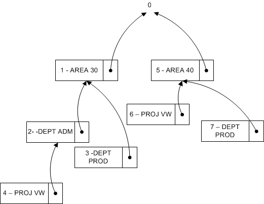

# Detaily návrhu: Vyhledávání kombinací dimenzí
When you close a page after you edit a set of dimensions, [!INCLUDE[prod_short](includes/prod_short.md)] evaluates whether the edited set of dimensions exists. Pokud sada neexistuje, vytvoří se nová sada a vrátí se ID kombinace dimenzí.

## Budování stromu vyhledávání
Table 481 **Dimension Set Tree Node** is used when [!INCLUDE[prod_short](includes/prod_short.md)] evaluates whether a set of dimensions already exists in table 480 **Dimension Set Entry** table. Vyhodnocení se provádí rekurzivně procházením vyhledávacího stromu počínaje nejvyšší úrovní s číslem 0. Nejvyšší úroveň 0 představuje sadu dimenzí bez položek sady dimenzí. Podřízené sady této sady dimenzí představují sady dimenzí pouze s jednou položkou. Podřízené sady těchto sad dimenzí představují sady dimenzí se dvěmi podřízenými a tak dále.

### Příklad 1
Následující diagram představuje vyhledávací strom se šesti sadami dimenzí. V diagramu je zobrazena pouze položka rozlišovací sady dimenzí.


Následující tabulka popisuje úplný seznam položek sady dimenzí, které tvoří každou sadu dimenzí.

| Sady dimenzí | Položky sady dimenzí |
|--------------------|---------------------------|  
| Sada 0 | Žádné |
| Sada 1 | AREA 30 |
| Sada 2 | AREA 30, DEPT ADM |
| Sada 3 | AREA 30, DEPT PROD |
| Sada 4 | AREA 30, DEPT ADM, PROJ VW |
| Sada 5 | AREA 40 |
| Sada 6 | AREA 40, PROJ VW |

### Příklad 2
This example shows how [!INCLUDE[prod_short](includes/prod_short.md)] evaluates whether a dimension set that consists of the dimension set entries AREA 40, DEPT PROD exists.

First, [!INCLUDE[prod_short](includes/prod_short.md)] also updates the **Dimension Set Tree Node** table to make sure that the search tree looks like the following diagram. Sada dimenzí 7 se tak stává podřízenou sadou dimenzí 5.



### Hledání ID sady dimenzí
At a conceptual level, **Parent ID**, **Dimension**, and **Dimension Value**, in the search tree, are combined and used as the primary key because [!INCLUDE[prod_short](includes/prod_short.md)] traverses the tree in the same order as the dimension entries. Funkce GET (záznam) se používá k vyhledání ID sady dimenzí. Následující příklad kódu ukazuje, jak najít ID sady dimenzí, pokud existují tři hodnoty dimenze.

```
DimSet."Parent ID" := 0;  // 'root'  
IF UserDim.FINDSET THEN  
  REPEAT  
      DimSet.GET(DimSet."Parent ID",UserDim.DimCode,UserDim.DimValueCode);  
  UNTIL UserDim.NEXT = 0;  
EXIT(DimSet.ID);  

```

However, to preserve the ability of [!INCLUDE[prod_short](includes/prod_short.md)] to rename both a dimension and a dimension value, table 349, **Dimension Value**, is extended with an integer field, **Dimension Value ID**. This table converts the field pair, **Dimension** and **Dimension Value**, to an integer value. Při přejmenování dimenze a hodnoty dimenze se celá hodnota nezmění.

```
DimSet."Parent ID" := 0;  // 'root'  
IF UserDim.FINDSET THEN  
  REPEAT  
      DimSet.GET(DimSet.ParentID,UserDim."Dimension Value ID");  
  UNTIL UserDim.NEXT = 0;  
EXIT(DimSet.ID);  

```

## Viz také

[GET Function (Record)](/dynamics-nav/GET-Function--Record-)    
[Design Details: Dimension Set Entries](design-details-dimension-set-entries.md)   
[Dimension Set Entries Overview](design-details-dimension-set-entries-overview.md)   
[Design Details: Table Structure](design-details-table-structure.md)


[!INCLUDE[footer-include](includes/footer-banner.md)]
