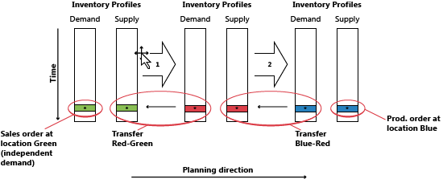
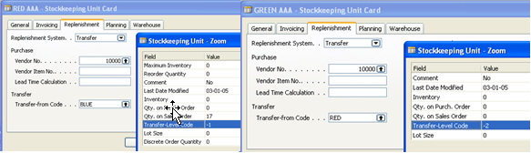
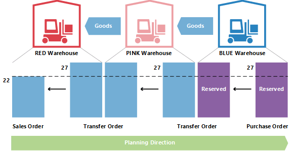

# Detaily návrhu: Transfery v plánování
Objednávky transferu jsou také zdrojem dodávek při práci na úrovni skladových jednotek. Při použití více lokací (skladů) lze systém doplnění skladové jednotky nastavit na Transfer, což znamená, že lokace je doplněna převodem zboží z jiného skladu. V situaci s více sklady mohou mít společnosti řetězce transferů, kdy pomocí dodávek ze skladu je ZELENÝ sklad doplňován transferem ze skladu ŽLUTÝ a ŽLUTÝ je doplněn tranferem ze skladu ČERVENÝ. Na začátku řetězce je systém doplňování Nákup nebo Montážní zakázka.

> [!NOTE]
> [!INCLUDE [locations-cronus](includes/locations-cronus.md)]

Při porovnávání situace, kdy objednávka dodávek přímo čelí objednávce poptávky, se situací, kdy je prodejní objednávka dodávána prostřednictvím řetězce transferů skladových položek, je zřejmé, že plánováníl v poslední uvedené situaci se může stát velmi složitým. Pokud se poptávka změní, může to způsobit dominový efekt v řetězci dodávek, protože všechny objednávky transferu včetně Nákupu/Výrobní zakázky na opačném konci řetězce budou muset být manipulovány, aby se obnovila rovnováha mezi poptávkou a nabídkou.

## Proč je Transfer speciálí případ?
Objednávka transferu vypadá podobně jako jakákoli jiná objednávka v systému. Nicméně, na pozadí je to velmi odlišné

Jedním ze základních aspektů, který dělá transfery v plánování odlišné od nákupu a výrobních zakázek, je to, že řádek transferu představuje poptávku a nabídku současně. Odchozí část, která je dodávána ze staré lokace, je poptávka. Příchozí část, která má být přijata na novém skladě, je popávkou v tomto místě.

To znamená, že když systém manipuluje s nabídkovou stranou transferu, musí provést podobnou změnu na straně poptávky.

## Transfery závislé na poptávce
Související poptávka a nabídka se určitým způsobem podobají částí řádku výrobní zakázky, ale rozdíl je v tom, že komponenty budou na další plánovací úrovni a s jinou položkou, zatímco obě části transferu se nacházejí na stejné úrovni pro stejné zboží.

Důležitá podobnost je, že stejně jako komponenty je závislá poptávka, tak i poptávka po transferu. Poptávka z řádku transgeru je dána nabídkovou stranou transferu v tom smyslu, že pokud dojde ke změně nabídky, je poptávka přímo ovlivněna.

Pokud flexibilita plánování není Žádná, řádek transferu by nikdy neměl být považován za nezávislou poptávku při plánování.

V plánováním by měla být poptávka po transferu zohledněna až poté, co byla strana nabídky zpracována plánovacím systémem. Před tím není známa skutečná poptávka. Pořadí provedených změn je proto velmi důležité, pokud jde o objednávky transferu.

## Pořadí plánování
Následující obrázek znázorňuje, jak by mohl řetězec transferů vypadat.

V tomto příkladu zákazník objedná zboží z lokace ZELENÝ. Na lokaci ZELENÝ je dodáváno transferem z centrálního skladu ČERVENÝ. Centrální sklad ČERVENÝ je zásobován transferem z lokace výroby MODRÝ.

V tomto příkladu začne plánovací systém na základě požadavku zákazníka a bude se v řetězci propracovávat zpětně. Požadavky a dodávky budou zpracovány po jedné lokaci.

## Kód úrovně transferu
Pořadí, ve kterém jsou lokace zpracována v plánovacím systému, je určeno kódem úrovně transferu na skladové jednotce.

Kód úrovně transferu je interní pole, které se automaticky vypočítá a uloží skladové jednotce při vytvoření nebo úpravě skladové jednotky. Výpočet běží napříč všemi skladovými daty pro danou kombinaci položky nebo varianty a používá kód lokace a kód transferu z k určení postupu, které bude muset plánování použít při procházení skladových jednotek, aby bylo zajištěno, že jsou zpracovány všechny požadavky.

Kód úrovně transferu bude 0 pro skladové jednotky se systémem doplnění Nákup nebo Výr. objednávka a bude -1 pro první úroveň transferu, -2 pro druhou a tak dále. Ve výše popsaném řetězci transferů by tedy úrovně byly -1 pro ČERVENÝ a -2 pro ZELENÝ, jak je znázorněno na následujícím obrázku.

Při aktualizaci skladové jednotky systém plánování zjistí, zda jsou skladové jednotky se systémem doplnění Transfer nastaveny s cyklickými odkazy.

## Plánování transferů bez skladové jednotky

I v případě, že funkce skladové jednotky není použita, je možné použít lokaci a provádět transfery ručně mezi lokacemi. Pro společnosti s méně pokročilým nastavením skladu podporuje systém plánování scénáře, kdy jsou existující zásoby převedeny ručně na jinou lokaci, například za účelem pokrytí prodejní objednávky v dané lokaci. Zároveň by měl plánovací systém reagovat na změny v poptávce.

Pro podporu ručních transferů bude plánování analyzovat existující objednávky transferu a poté naplánuje pořadí, ve kterém mají být loakce zpracovány. Interně bude plánovací systém pracovat s dočasnými skladovými jednotkami nesoucími kódy úrovně transferu.

Pokud existuje více transferů do daného umístění, první objednávka transferu definuje směr plánování. Transfery probíhající v opačném směru budou zrušeny.

## Změna množství s rezervacemi
Při změně množství na existující dodávce zohledňuje plánovací systém výhrady v tom smyslu, že rezervované množství představuje spodní hranici toho, o kolik lze snížit dodávku.

Při změně množství na existujícím řádku objednávky transferu mějte na paměti, že dolní limit bude definován jako nejvyšší rezervované množství řádku odchozího a příchozího transferu.

Pokud je například řádek objednávky transferu na 117 kusů rezervován proti prodejnímu řádku  s 46 a nákupnímu řádku s 24, není možné snížit řádek převodu pod 46 kusů, i když to může představovat nadbytečnou dodávku na příchozí stran.

## Změna množství v řetězci transferu
V následujícím příkladu je výchozím bodem vyvážená situace s objednávkou transferu dodávající prodejní objednávku s 27 ks na lokaci ČERVENÝ s odpovídající nákupní objednávkou na lokaci MODRÝ, transferovamou prostřednictvím lokace RŮŽOVÝ. Kromě prodeje a nákupu existují dvě objednávky transferu: MODRÝ-RŮŽOVÝ a RŮŽOVÝ-ČERVENÝ.

Nyní se plánovač na lokaci RŮŽOVÝ rozhodne rezervovat proti nákupu.

To obvykle znamená, že plánovací systém bude ignorovat nákupní objednávku a požadavek na transfer. Dokud bude rovnováha, nebude problém. Co se ale stane, když zákazník v lokalitě ČERVENÝ částečně lituje objednávky a změní ji na 22?

Když se plánovací systém znovu spustí, měl by se zbavit přebytečné nabídky. Rezervace však uzamkne nákup a transfer na množství 27.

Transfer RŮŽOVÝ-ČERVENÝ byl snížen na 22. Příchozí část transferu MODRÝ-RŮŽOVÝ není rezervovaný, ale protože odchozí část je rezervovaná, není možné množství snížit na 27.

## Výpočet průběžné doby
Při výpočtu data splatnosti objednávky transferu budou vzaty v úvahu různé druhy dodací lhůty.

Dodací lhůty, které jsou aktivní při plánování objednávky transferu, jsou:

* Doba zpracování odchozího skladu
* Dodací lhůta
* Doba zpracování příchozího skladu
* Na řádku plánování se k poskytnutí informací o výpočtu používají následující pole.
* Datum dodávky transferu
* Počáteční datum
* Koncové datum
* Datum splatnosti

Datum odeslání řádku transferu se zobrazí v poli Datum dodávky a v poli datum splatnosti se zobrazí datum příjmu řádku transferu.

Počáteční a koncové datum bude použito k popisu skutečného období přepravy.

Následující obrázek ukazuje interpretaci počátečního data a času na plánovacích řádcích souvisejících s objednávkami transferů.

V tomto příkladu to znamená, že:

* Datum dodávky + Výstupní zpracování = Počáteční datum
* Počáteční datum + Čas odeslání = Koncové datum
* Koncové datum + Vstupní zpracování = Datum přímu

## Bezpečnostní dodací lhůta
Pole Výchozí bezp.průběžná doba v nastavení výroby a související pole Bezpečná průběžná doba na kartě zboží nebude při výpočtu objednávky transferu zohledněno. Nicméně Bezpečná průběžná doba bude mít stále vliv na celkový plán, jako bude mít vliv na objednávku doplnění (nákup nebo výrobu) na začátku řetězce transferu, když je zboží umístěno na skladě, ze kterého budou transferovány.

Na řádku výrobní zakázky koncové datum + bezpečná průběžná doba + vstupní doba zpracování = Datum splatnosti.

Na řádku nákupní objednávky plánované datum příjmu + bezpečná průběžná doba + vstupní doba zpracování = očekávané datum příjmu.

## Přeplánování
Při přeplánování existujícího řádku transferu musí systém plánování vyhledat odchozí část a změnit datum a čas. Je důležité si uvědomit, že pokud byl definován dodací čas, mezi dodávkou a příjmem bude mezera. Jak již bylo zmíněno, dodací lhůta se může skládat z více prvků, jako je čas přepravy a doba zpracování skladu. Na časové ose se plánovací systém posune zpět v čase, zatímco vyvažuje prvky.

Proto při změně data splatnosti na řádku transferu musí být vypočtena doba realizace, aby bylo možné aktualizovat odchozí stranu transferu.

## Sériová čísla a čísla šarží v transferech
Pokud poptávka nese sériová čísla/čísla šalží a plánovací modul je aktivní, povede to k některým přímo vytvořeným objednávkám transferu. Další informace o tomto konceptu naleznete v tématu Atributy zboží. Pokud jsou však sériová čísla/čísla šalží odebrána z poptávky, vytvořené převodní příkazy v řetězci budou stále nést sériová čísla/čísla šalží, a proto budou plánováním ignorována (nebudou odstraněna).

## Propojení Zakázka-na-Zalázku
V tomto příkladu je skladová jednotka nastavena systémem na MODRÝ a pomocí přionjednání, zatímco RŮŽOVÝ A ČERVENÝ využívá dávka pro dávku. Když je vytvořena prodejní objednávka s 27ks na lokaci ČERVENÝ, povede to k tomu, že řetězec transferů s posledním spojením v lokaci MODRÝ bude rezervován s vazbou. V tomto příkladu rezervace nejsou pevné a vytvořené plánovačem v lokaci RŮŽOVÝ, ale vazby vytvořené systémem plánování. Důležitým rozdílem je, že plánovací systém to může změnit.

Pokud se poptávka změní z 27 na 22, systém sníží množství v řetězci, přičemž se sníží také závazná rezervace.

## Viz také
[Detaily návrhu: Parametry plánování](design-details-planning-parameters.md)   
[Detaily návrhu: Tabulka přiřazení plánování](design-details-planning-assignment-table.md)   
[Detaily návrhu: Zpracování způsobu přiobjednání](design-details-handling-reordering-policies.md)   
[Detaily návrhu: Poptávka v prázdném skladu](design-details-demand-at-blank-location.md)   
[Detaily návrhu: Centrální koncepce plánovacího systému](design-details-central-concepts-of-the-planning-system.md)   
[Detaily návrhu: Vyvažování poptávky a nabídky](design-details-balancing-demand-and-supply.md)   
[Detaily návrhu: Plánování dodávek](design-details-supply-planning.md)

[!INCLUDE[footer-include](includes/footer-banner.md)]