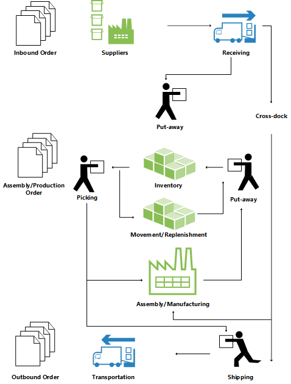

# Detaily návrhu: Přehled skladu
Pro podporu fyzického zpracování zboží v zónách a úrovních přihrádek musí být všechny informace sledovány pro každou transakci nebo přesun ve skladu. This is managed in the **Warehouse Entry** table. Každá transakce je uložena v žurnálech skladu.

Skladové doklady a deník skladu se používají k evidenci pohybů zboží ve skladu. Pokaždé, když je zboží ve skladu přesunuto, přijato, zaskladněno, vyskladněno, dodáno nebo upraveno, jsou záznamy ve skladu evidovány pro fyzické uložení informací o zóně, přihrádce a množství.

The **Bin Content** table is used to handle all the different dimensions of the contents of a bin per item, such as unit of measure, maximum quantity, and minimum quantity. The **Bin Content** table also contains flow fields to the warehouse entries, warehouse instructions, and warehouse journal lines, which ensures that the availability of an item per bin and a bin for an item can be calculated quickly. For more information, see [Design Details: Availability in the Warehouse](design-details-availability-in-the-warehouse.md).

Pokud se zaúčtování položky vyskytne mimo modul skladu, použije se pro synchronizaci položek skladu se skladovým zbožím výchozí adjustační přihrádka na lokaci. Během fyzické inventury skladu jsou rozdíly mezi vypočteným a spočítanými množstvími zaznamenány do adjustační přihrádky a pak zaúčtovány jako opravné položky zboží. For more information, see [Design Details: Integration with Inventory](design-details-integration-with-inventory.md).

Následující obrázek nastiňuje typické procesy skladu.

## Základní nebo rozšířené skladování
Warehouse functionality in [!INCLUDE[prod_short](includes/prod_short.md)] can be implemented in different complexity levels, depending on a company’s processes and order volume. Hlavní rozdíl spočívá v tom, že činnosti se provádějí v základním skladu, v případě, že jsou konsolidovány pro více objednávek v rozšířeném skladu.

Pro rozlišení mezi různými úrovněmi složitosti se tato dokumentace týká dvou obecných označení, základního a rozšířeného skladování. Toto jednoduché rozlišení zahrnuje několik různých úrovní složitosti, jak je definováno v granulích produktu a v nastavení umístění, které jsou podporovány různými UI dokumenty. Pro více informací navštivte [Detaily návrhu: Nastavení skladu](design-details-warehouse-setup.md).

> [!NOTE]  
> The most advanced level of warehousing is referred to as “WMS installations” in this documentation, since this level requires the most advanced granule, Warehouse Management Systems.

V základním a rozšířeném skladu se používají následující různé dokumenty uživatelského rozhraní.

## Základní doklady uživatelského rozhraní

- **Inventory Put-away**
- **Inventory Pick**
- **Inventory Movement**
- **Item Journal**
- **Item Reclassification Journal**
- (Různé sestavy)

## Pokročilé doklady uživatelského rozhraní

- **Warehouse Receipt**
- **Put-away Worksheet**
- **Warehouse Put-away**
- **Pick Worksheet**
- **Warehouse Pick**
- **Movement Worksheet**
- **Warehouse Movement**
- **Internal Whse. Pick**
- **Internal Whse. Put-away**
- **Bin Creation Worksheet**
- **Bin Content Creation Worksheet**
- **Whse. Item Journal**
- **Whse. přeřazení  Journal**
- (Různé sestavy)

Další informace o jednotlivých dokumentech naleznete v příslušných tématech na stránce.

### Terminologie
To align with the financial concepts of purchases and sales, [!INCLUDE[prod_short](includes/prod_short.md)] warehouse documentation refers to the following terms for item flow in the warehouse.

| Termín | Popis |
|----------|---------------------------------------|  
| Vstupní tok | Položky pohybující se do umístění skladu, jako jsou nákupy a příchozí transfery. |
| Vnitřní tok | Položky pohybující se uvnitř skladu, například výrobní komponenty a výstup. |
| Odchozí tok | Položky pohybující se mimo umístění skladu, například prodej a odchozí transfery. |

## Viz také
[Detaily návrhu: Správa skladu](design-details-warehouse-management.md)

[!INCLUDE[footer-include](includes/footer-banner.md)]