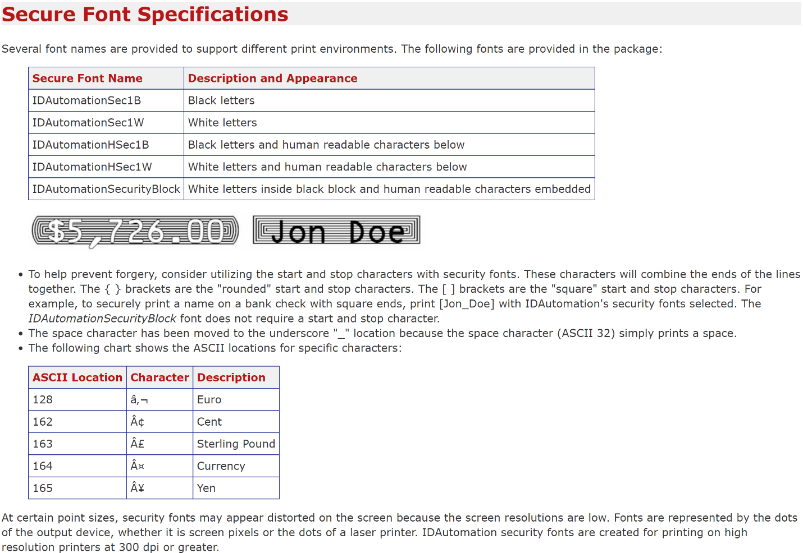

# Výběr rozložení šeku

Šeky můžete navrhnout tak, aby odpovídaly normám stanoveným místními úřady. Šeky lze vytisknout v angličtině, francouzštině nebo španělštině.

Šeky jsou určeny k tisku ve formátu pro Spojené státy i Kanadu ve formátu check-stub-check nebo ve formátu stub-stub-check.

## Výběr rozvržení šeku

1. Choose the  icon, enter **Report Selections Bank Account**, and then choose the related link.
2. On the **Report Selection - Bank Acc.** page, in the **Usage** field, select **Check**.
3. Vyberte jedno z následujících ID sestavy.

| ID Sestavy | Titulek Sestavy | Popis |
| --- | --- | --- |
| 1401 | Šek | Toto je výchozí sestava. |
| 10411 | Šek (Stub/Stub/Check) | Tato sestava je ve formátu stub/stub/check. |
| 10412 | Šek (Stub/Check/Stub) | Tato sestava je ve formátu stub/check/stub. |
| 10413 | Tři šeky na stránku | Tato sestava je určena k tisku tří šeků na každé stránce. |

When you have set up check layouts, you can print checks from the **Payment Journal** page. For more information, see [Work with Checks](payables-how-work-checks.md).

Chcete-li změnit jedno z těchto výchozích rozvržení šeků, použijte k tomu integraci Word nebo RDLC. For more information, see [Create and Modify Custom Report Layouts](ui-how-create-custom-report-layout.md).

## Použití MICR a bezpečtnostního písma

The online version of [!INCLUDE[prod_short](includes/prod_short.md)] contains pre-installed fonts on the servers that can be used when defining check layouts. Následující přehled popisuje, které fonty jsou k dispozici, a obsahuje odkazy na podrobné informace od dodavatelů fontů třetích stran.

> [!Important]
> MICR and check security fonts in Microsoft Dynamics [!INCLUDE[prod_short](includes/prod_short.md)] are licensed in a font package from IDAutomation.com, Inc. These products may only be used as part of and in connection with Microsoft Dynamics [!INCLUDE[prod_short](includes/prod_short.md)].

V aktualizaci 15.3 a novější jsou nainstalovány a dostupné fonty Magnetic Ink Character Recognition (MICR).. Jsou podporovány jak standardy E-13B, tak CMC-7. Kromě písem MICR jsou k dispozici speciální bezpečnostní písma pro generování textu, názvů, částek a symbolů měny Dolar, Euro, Libra a Jen, se kterými se po vytištění šeku těžko manipuluje.

> [!NOTE]
> For security and legal reasons, you cannot upload custom fonts to the [!INCLUDE[prod_short](includes/prod_short.md)] environment.

### Specifikace MICR E-13B

Následující souhrny specifikací pro fonty MICR E-13B, které mohou být užitečné při kalibraci fontů, které mají být na rozložení šeku s konkrétními tiskárnami MICR.

### Delimiter characters

Úplnou specifikaci fontů MICR E-13B naleznete v dokumentaci dodavatele zde: (https://www.idautomation.com/micr-fonts/e13b/).

### Specifikace MICR CMC-7

The following CMC-7 fonts are available in [!INCLUDE[prod_short](includes/prod_short.md)] online:

- IDAutomationCMC7
- IDAutomationCMC7n10
- IDAutomationCMC7n25
- IDAutomationCMC7n40

Následující souhrny specifikací pro fonty MICR CMC-7, které mohou být užitečné při kalibraci fontů, které mají být na  rozložení šeků s konkrétními tiskárnami MICR.

### Delimiter characters

Úplnou specifikaci fontů MICR CMC-7 naleznete v dokumentaci dodavatele zde: (http://www.idautomation.com/micr-fonts/cmc7/).

### Specifikace bezpečnostního fontu

Následující souhrny shrnují specifikace pro bezpečnostní fonty šeků, které mohou být užitečné při kalibraci fontů, které mají být na rozložení šeku s konkrétními tiskárnami MICR.

Úplnou specifikaci bezpečnostních fontů naleznete v dokumentaci dodavatele zde: (https://www.idautomation.com/security-fonts/).

Fonts for other purposes are also available in [!INCLUDE[prod_short](includes/prod_short.md)]. For more information, see [Available Fonts](ui-fonts.md)

## Viz také

[Create and Modify Custom Report Layouts](ui-how-create-custom-report-layout.md)  
[Fonts in Business Central](ui-fonts.md)  
[Managing Payables](payables-manage-payables.md)  
[Reconciling Bank Accounts](bank-manage-bank-accounts.md)   
[Completing Period-End Processes](year-how-complete-period-end-processes.md)  
[Working with [!INCLUDE[prod_short](includes/prod_short.md)]](ui-work-product.md)  
[General Business Functionality](ui-across-business-areas.md)

[!INCLUDE[footer-include](includes/footer-banner.md)]