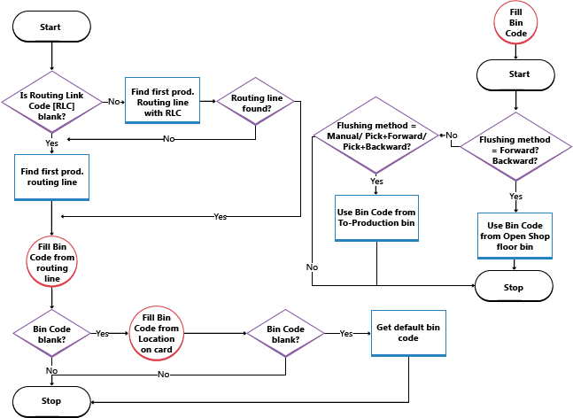

# Nastavení základních skladů s provozními oblastmi
If internal operation areas such as production or assembly exist in basic warehouse configurations where locations use the **Bin Mandatory** setup field and possibly the **Require Pick** and **Require Put-away** setup fields, then you can use the following basic warehouse documents to record your warehouse activities for internal operation areas:

- **Inventory Movement** page.
- **Inventory Pick** page.
- **Inventory Put-away** page.

> [!NOTE]
> Even though the settings are called **Require Pick** and **Require Put-away**, you can still post receipts and shipments directly from the source business documents at locations where you select these check boxes.

Chcete-li tyto stránky použít k interním operacím, například k vyskladnění a přesunu komponent do výroby, je třeba provést některé nebo všechny následující kroky nastavení podle toho, jakou kontrolu potřebujete:

- Povolte doklady vyskladnění zásob, přesunutí a zaskladnění.
- Definujte výchozí struktury přihrádek pro komponenty a koncové položky, které budou proudit do a z provozních zdrojů.
- Vytvořte do- a z- přihrádky vyhrazené pro konkrétní provozní zdroje, aby se zabránilo vyskladnění zboží výstupními doklady

Kódy přihrádek nastavené na kartách lokace definují výchozí tok skladu pro určité aktivity, například komponenty v oddělení montáže. Existují další funkce, které zajistí, že když jsou položky umístěny do určité přihrádky, nemohou být přesunuty nebo vydány do jiných aktivit. For more information, see [To create dedicated component bins](warehouse-how-to-set-up-basic-warehouses-with-operations-areas.md#to-create-dedicated-component-bins).

Následující postupy jsou založeny na nastavení základních aktivit skladu v oblasti výroby. Kroky jsou podobné pro další oblasti činnosti, jako je montáž, servis a projekty.

> [!NOTE]  
> In the following procedure, the **Bin Mandatory** setup field on location cards is selected as a precondition because that is considered the foundation for any level of warehouse management.

## Povolení skladových dokladů pro interní operace skladu
1. Vyberte ikonu , zadejte **Lokace** a poté vyberte související odkaz.
2. Otevřete kartu lokace, kterou chcete nastavovat.
3. On the **Warehouse** FastTab, select the **Require Put-away** check box to indicate that, when an inbound or internal source document with a bin code is released, an inventory put-away or an inventory movement document can be created.
4. Select the **Require Pick** check box to indicate that when an outbound or internal source document with a bin code is created, an inventory pick or an inventory movement document must be created.

## Definování výchozí struktury přihrádky v oblasti výroby

1. Vyberte ikonu , zadejte **Lokace** a poté vyberte související odkaz.
2. Otevřete lokaci, kterou chcete nastavovat.
3. On the **Bins** FastTab, in the **Open Shop Floor Bin Code** field, enter the code of the bin in the production area with plenty of components that the machine operator can consume from without requesting a warehouse activity to bring them to the bin. Zboží, které jsou umístěny v této přihrádce, se obvykle nastavují pro automatické účtování nebo vyčištění. This means that the **Flushing Method** field contains **Forward** or **Backward**.
4. In the **To-Production Bin Code** field, enter the code of the bin in the production area where components that are picked for production at this location are placed by default before they can be consumed. Položky, které jsou umístěny v této přihrádce, jsou obvykle nastaveny pro ruční účtování spotřeby. This means that the **Flushing Method** field contains **Manual** or **Pick + Forward** or **Pick + Backward** for warehouse picks and inventory movements.

   > [!NOTE]  
   > When you use inventory picks, the **Bin Code** field on a production order component line defines the *take* bin from where components are decreased when posting consumption. When you use inventory movements, the **Bin Code** field on production order component lines defines the *place* bin in the operation area where the warehouse worker must place the components.

5. On the **Bins** FastTab, in the **From-Production Bin Code** field, enter the code of the bin in the production area where finished end items are taken from by default when the process involves a warehouse activity. V základních konfiguracích skladu je aktivita zaznamenána jako zaskladnění zásob nebo přesun zásob.

Nyní, řádky komponenty výrobní zakázky s výchozím kódem přihrádky vyžadují, aby byly do této složky umístěny předem spotřebované komponenty. Dokud však nebudou komponenty spotřebovány z této přihrádky, mohou z této přihrádky vybírat nebo spotřebovávat další požadavky na komponenty, protože jsou stále považovány za dostupný obsah přihrádky. To make sure that bin content is only available to component demand that uses that to-production bin, you must select the **Dedicated** field on the line for that bin code on the **Bins** page that you open from the location card.

This flow chart shows how the **Bin Code** field on production order component lines is filled according to your setup.

## Definování výchozí struktury přihrádek v oblasti montáže
Komponenty pro montážní zakázky nemohou být vydány nebo zaúčtovány s vyskladněním zásob. Instead, use the **Inventory Movement** page. For more information, see [Move Components to an Operation Area in Basic Warehousing](warehouse-how-to-move-components-to-an-operation-area-in-basic-warehousing.md).

Při Vyskladnění a odesílání prodejních řádků, které jsou smontovány pro objednávku, musíte při vytváření řádků vyskladnění zásob dodržet určitá pravidla. For more information, see the “Handling Assemble-to-Order Items in Inventory Picks” section in [Pick Items with Inventory Picks](warehouse-how-to-pick-items-with-inventory-picks.md).

Pro více informací navštivte [Správa montáže](assembly-assemble-items.md).

### Nastavení automatického vytvoření přesunu při vyskladnění zásob pro montážní zakázku
1. Choose the  icon, enter **Assembly Setup**, and then choose the related link.
2. Select the **Create Movements Automatically** check box.

### Nastavit přihrádky montáže, ve které jsou komponenty ve výchozím nastavení umístěny, než mohou být spotřebovány
The value in this field is automatically inserted in the **Bin Code** field on assembly order lines when this location is entered in the **Location Code** field on the assembly order line.

1. Vyberte ikonu , zadejte **Lokace** a poté vyberte související odkaz.
2. Otevřete lokaci, kterou chcete nastavovat.
3. Fill in the **To-Assembly Bin Code** field.

### Nastavení přihrádky montáže, do které se při dokončení montáže zaúčtuje hotové zboží
The value in this field is automatically inserted in the **Bin Code** field on assembly order headers when this location code is filled into the **Location Code** field on the assembly order header.

Kódy přihrádek nastavené na kartách lokace definují výchozí tok skladu pro specifické aktivity skladu, jako je například spotřeba komponent v oblasti montáže. Existují další funkce, které zajistí to, že případě umístění zboží do výchozí přihrádky, nemohou být přesunuty nebo vydány do jiných aktivit.

> [!NOTE]
> This setup is only possible for locations where the Bin Mandatory field is selected.

1. Vyberte ikonu , zadejte **Lokace** a poté vyberte související odkaz.
2. Otevřete lokaci, kterou chcete nastavovat.
3. Fill in the **From-Assembly Bin Code** field.

### Nastavení přihrádky, do níž je dokončené zboží montáže zaúčtováno, jakmile jsou montáže propojené prodejní objednávky
Z této přihrádky je zboží montáže odesláno okamžitě, prostřednictvím vyskladnění, k naplnění prodejní objednávky.

> [!NOTE]
> This field cannot be used if the location is set up to use directed pick and put-away.

Kód přihrádky se kopíruje z řádku prodejní objednávky do hlavičky montážní zakázky, aby bylo sděleno pracovníkům montáže, kam mají umístit výstup pro expedici. Zkopíruje se také do řádku vyskladnění, aby bylo možné sdělit pracovníkům skladu, odkud je mají převzít.

> [!NOTE]
> The Assemble-to-Order Shipment bin is always empty. Při zaúčtování prodejního řádku montáže na zakázku je obsah přihrádky nejprve pozitivně upraven pomocí výstupu montáže. Ihned poté je negativně upraveno s dodaným množstvím.

The value in this field is automatically inserted in the Bin Code field on sales order lines that contain a quantity in the **Qty. to Assemble to Order** field or if the item to be sold has **Assemble-to-Order** in the **Replenishment System** field.

If the **Asm.-to-Order Shpt. Bin Code** is blank, then the **From-Assembly Bin Code** field is used instead. If both setup fields are blank, then the last used bin with content is used in the **Bin Code** field on sales order lines.

The same bin code is in turn copied to the **Bin Code** field on the inventory pick line that manages the shipment of the assemble-to-order quantity. For more information, see the “Handling Assemble-to-Order Items in Inventory Picks” section in [Pick Items with Inventory Picks](warehouse-how-to-pick-items-with-inventory-picks.md).

1. Vyberte ikonu , zadejte **Lokace** a poté vyberte související odkaz.
2. Otevřete lokaci, kterou chcete nastavovat.
3. Fill in the **Asm.-to-Order Shpt. Bin Code** field.

## Vytvoření vyhrazených přihrádek komponent
Můžete určit, že množství v přihrádce je chráněno proti vyskladnění pro jiné požadavky než pro poptávku z jejich aktuálního účelu.

Množství v vyhrazených zásobnících může být stále rezervováno Accordingly, the quantities in dedicated bins are included in the **Total Available Quantity** field on the **Reservation** page.

For example, is a work center is set up with a bin code in the **To-Production Bin Code** field. Řádky komponenty výrobní zakázky s tímto kódem přihrádky vyžadují, aby byly do tohoto kódu umístěny předem vyprazdňované komponenty. Dokud však nebudou komponenty spotřebovány z této přihrádky, mohou z této přihrádky vybírat nebo spotřebovávat další požadavky na komponenty, protože jsou stále považovány za dostupný obsah přihrádky. To make sure that bin content is only available to component demand that uses that to-production bin, you must select the **Dedicated** field on the line for that bin code on the **Bins** page that you open from the location card.

Vytvoření vyhrazené přihrádky poskytuje podobnou funkci jako použití typů přihrádek, které jsou k dispozici pouze v rozšířeném skladu. For more information, see [Set Up Bin Types](warehouse-how-to-set-up-bin-types.md).

> [!Caution]
> Items in dedicated bins are not protected when they are picked and consumed as production components with the Inventory Pick page.

1. Vyberte ikonu , zadejte **Lokace** a poté vyberte související odkaz. Vyberte lokaci, kterou chcete aktualizovat.
2. Choose the **Bins** action.
3. Select the **Dedicated** field for each bin that you want to use exclusively for certain internal operations and where you want quantities to be reserved for that internal operation once placed there.

> [!NOTE]  
> The bin must be empty before you can select or clear the **Dedicated** field.

## Viz také
[Warehouse Management](warehouse-manage-warehouse.md)  
[Inventory](inventory-manage-inventory.md)  
[Setting Up Warehouse Management](warehouse-setup-warehouse.md)  
[Assembly Management](assembly-assemble-items.md)  
[Design Details: Warehouse Management](design-details-warehouse-management.md)  
[Work with [!INCLUDE[prod_short](includes/prod_short.md)]](ui-work-product.md)

[!INCLUDE[footer-include](includes/footer-banner.md)]