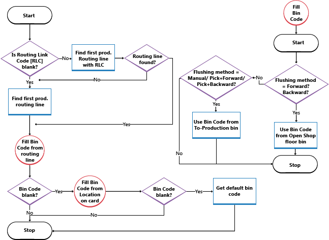

# Nastavení lokací pro použití přihrádek
Přihrádky představují základní skladovou strukturu a používají se k navrhování umístění zboží. Pokud jste vytvořili své přihrádky, můžete velmi přesně definovat obsah, který chcete umístit do každé přihrádky, nebo přihrádka může fungovat jako plovoucí přihrádka bez zadaného obsahu.

To use the bin functionality at a location, you first activate the functionality on the **Location** card. Pak navrhnete tok zboží v lokaci určením kódů přihrádek v polích nastavení, které představují různé toky.

> [!NOTE]  
> Before you can specify bin codes on the location card, the bin codes must be created. For more information, see [Create Bins](warehouse-how-to-create-individual-bins.md).

## Nastavení lokace pro použití přihrádek
1. Vyberte ikonu , zadejte **Lokace** a poté vyberte související odkaz.
2. Vyberte lokaci, kde chcete používat přihrádky.
3. Choose the **Edit** action.
4. On the **Warehouse** FastTab, select the **Bin Mandatory** check box.
5. If you are not using directed put-away and pick for the location, fill in the **Default Bin Selection** field with the method the system should use when assigning a default bin to an item.
6. Otevřete kartu lokace, pro kterou chcete vytvořit přihrádky.
7. On the **Bins** FastTab, select the bins that you want to use as the default for receipts, shipments, inbound, outbound, and open shop floor bins.
8. Kódy přihrádek, které zde vyplníte se automaticky zobrazí v hlavičkách a řádcích různých skladových dokladů. Výchozí přihrádky definují všechna počáteční a koncová umístění zboží ve skladu.
9. Pokud používáte řízené zaskladnění a vyskladnění, vyberte přihrádku pro adjustaci skladu. The bin code in the **Adjustment Bin Code** field defines the virtual bin in which to record discrepancies in inventory when you register either observed differences registered in the warehouse item journal, or differences calculated when you register a warehouse physical inventory.
10. Fill in the fields on the **Bin Policies** FastTab if they are relevant to your warehouse. The most important fields are **Bin Capacity Policy**, **Allow Breakbulk**, and **Put-away Template Code** fields.
11. On the **Warehouse** FastTab, fill in the **Outbound Whse. Handling Time**, **Inbound Whse. Handling Time**, and the **Base Calendar Code** fields. For more information, see [Set Up Base Calendars](across-how-to-assign-base-calendars.md).

## Plnění spotřební přihrádky 
This flow chart shows how the **Bin Code** field on production order component lines is filled according to your location setup.

## Viz také
[Správa skladu](warehouse-manage-warehouse.md)    
[Zásoby](inventory-manage-inventory.md)    
[Nastavení správy skladu](warehouse-setup-warehouse.md)       
[Správa montáže](assembly-assemble-items.md)      
[Detaily návrhu: Správa skladu](design-details-warehouse-management.md)    
[Práce s [!INCLUDE[prod_short](includes/prod_short.md)]](ui-work-product.md)

[!INCLUDE[footer-include](includes/footer-banner.md)]